# sist_coupang_2026

쿠팡과 유사한 웹 쇼핑몰 프로젝트(GoodPang). 이 문서는 관리자(admin) 관련 URL과, 배송완료 처리 URL 정보를 정리한 것입니다.

프로젝트 소스 위치: `project/GoodPang/src/main/java/com/goodpang/servlet`

## 관리자(Admin) 관련 URL

| URL | Method | Servlet | 설명 |
|---|---|---|---|
| `/admin/login` | GET, POST | AdminLoginServlet | 관리자 로그인 폼 조회 / 로그인 처리 |
| `/admin/logout` | GET, POST | AdminLogoutServlet | 관리자 로그아웃 |
| `/admin/dashboard` | GET | AdminDashboardServlet | 관리자 대시보드 |
| `/admin/products` | GET | AdminProductListServlet | 상품 목록 조회 |
| `/admin/product-approve` | POST | AdminProductApprovalServlet | 상품 승인 처리 |
| `/admin/sellers` | GET | SellerListServlet | 판매자(입점) 목록 조회 |
| `/admin/seller-detail` | GET | SellerDetailServlet | 판매자 상세 조회 (`?sellerNo=`) |
| `/admin/seller-approve` | POST | SellerApprovalServlet | 판매자 입점 승인 처리 |
| `/admin/deliveries` | GET | AdminDeliveryListServlet | 배송중인 상품 목록 조회 |
| `/admin/delivery-complete` | POST | AdminDeliveryCompleteServlet | 배송완료 처리 |

## 배송완료 URL

- **URL**: `POST /admin/delivery-complete`
- **Servlet**: `AdminDeliveryCompleteServlet` → `AdminDeliveryDAO.completeDelivery(deliveryNo)`
- **파라미터**: `deliveryNo` (int)
- **동작**: `DELIVERY.DELIVERY_STATUS`를 `배송중` → `배송완료`로 변경하고, 연결된 `ORDERS.ORDER_STATUS`도 `배송완료`로 함께 갱신. 처리 후 `/admin/deliveries` 목록으로 리다이렉트.
- **비고**: 현재는 배송기사 전용 계정이 없어 관리자가 `/admin/deliveries` 목록 화면에서 대신 완료 처리를 하고 있음 (`AdminDeliveryCompleteServlet.java` 주석 참고). 추후 배송기사 로그인/역할이 추가되면 이 URL의 권한 체크 로직을 관리자 전용에서 "본인 담당 배송건"으로 변경할 예정.

## 배송 JSON API (로그인 불필요)

`/deliveries/json`, `/delivery-complete/json` 등 로그인 없이 호출 가능한 JSON API 문서는 [readme_json.md](readme_json.md)로 분리했습니다.

## 프로젝트 화면 캡처

### 1. 쇼핑몰 메인 화면

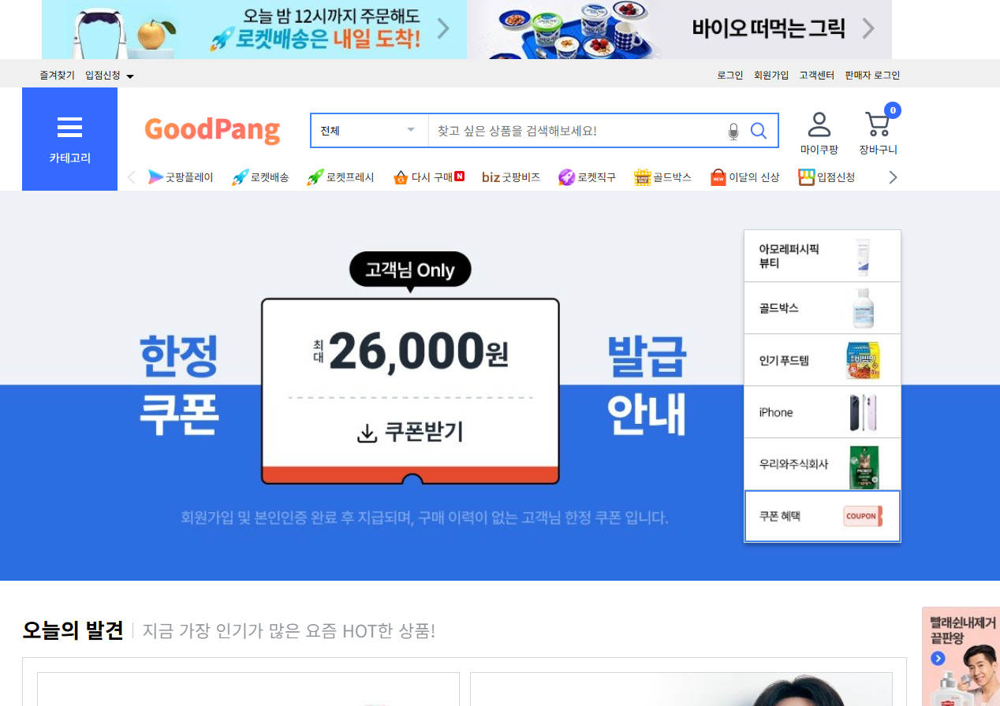

### 2. 판매자 로그인

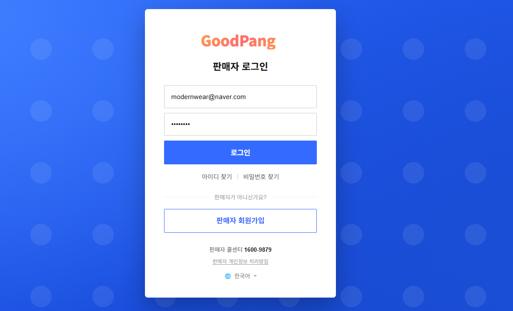

### 3. 판매자 대시보드

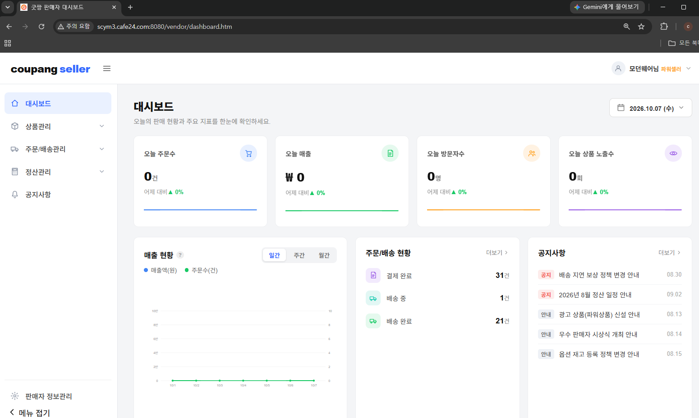

### 4. 상품 관리 (상품 목록)

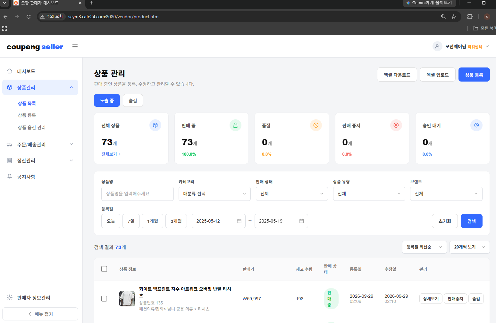

### 5. 상품 옵션 관리

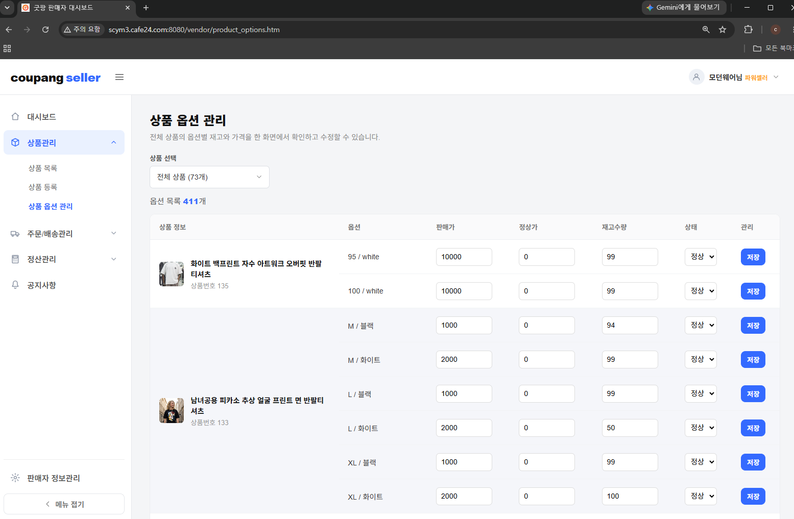

### 6. 상품 등록

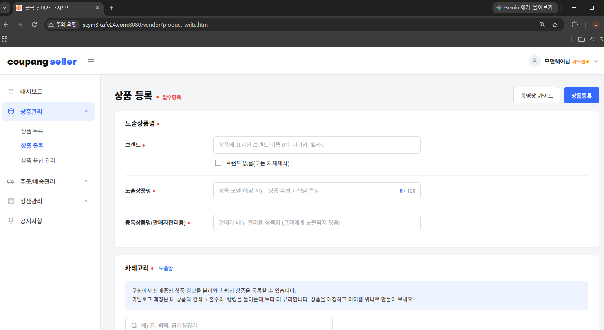

### 7. 주문/배송 관리 (주문 목록)

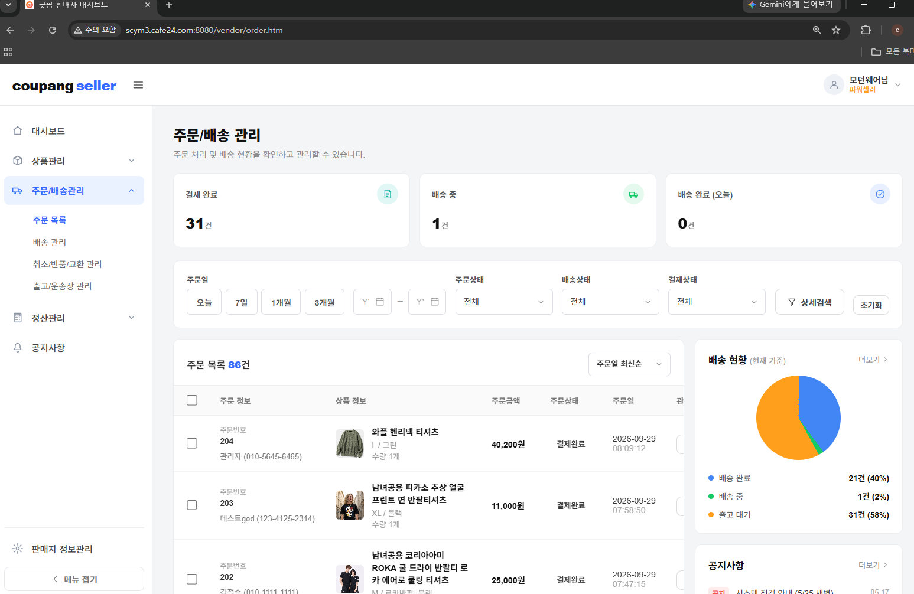

### 8. 배송 관리

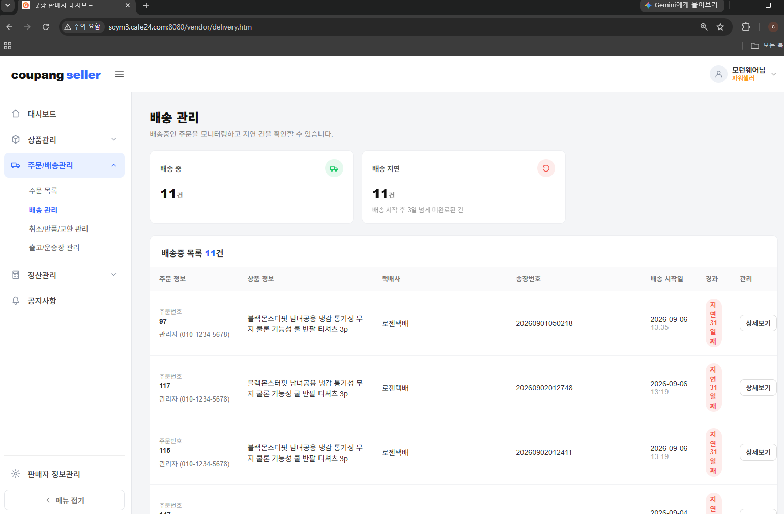

### 9. 취소/반품/교환 관리

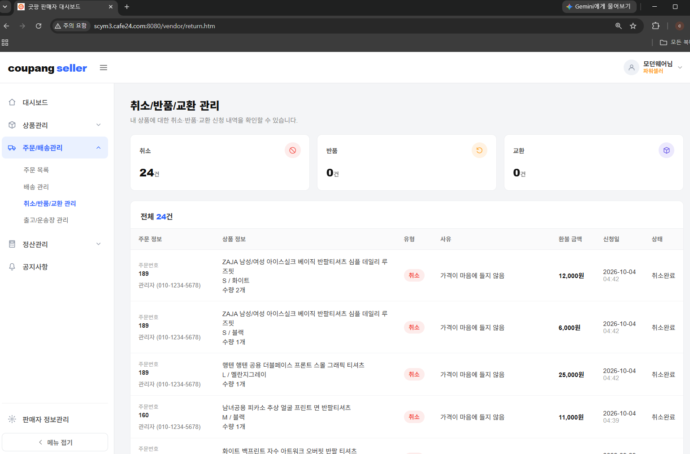

### 10. 출고/운송장 관리

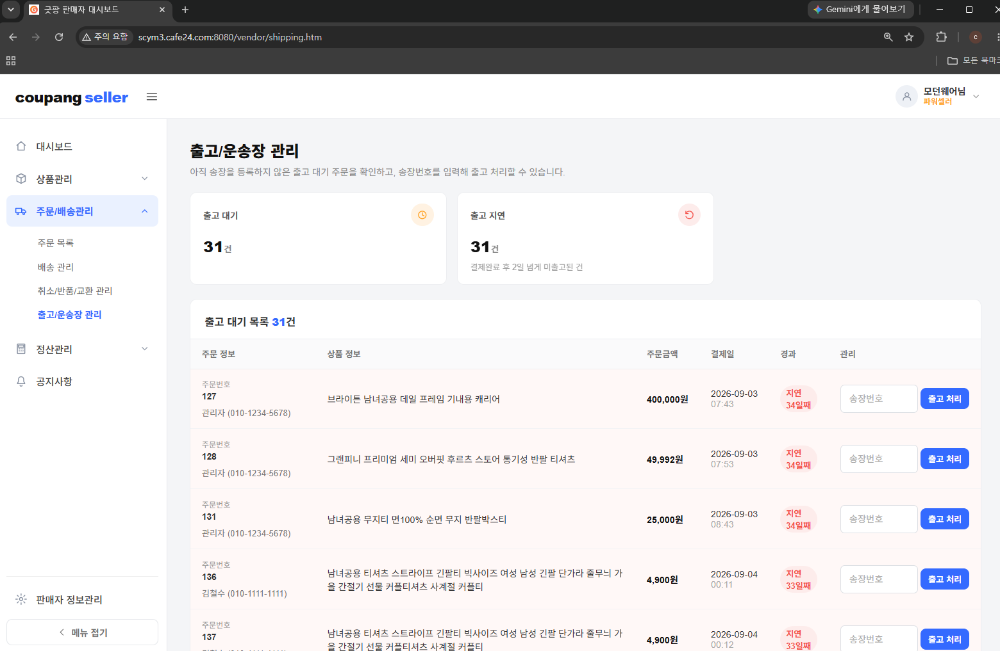

### 11. 정산내역 리스트

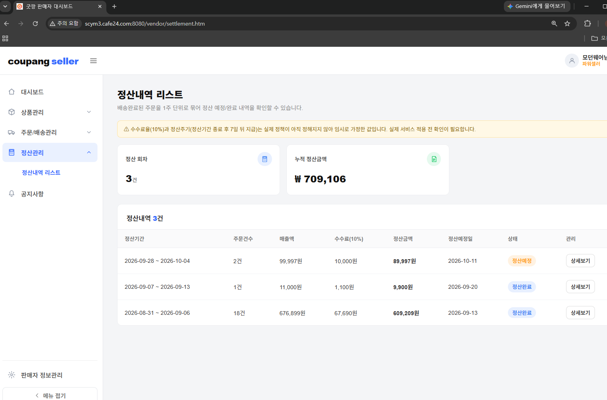

### 12. 판매자 공지사항

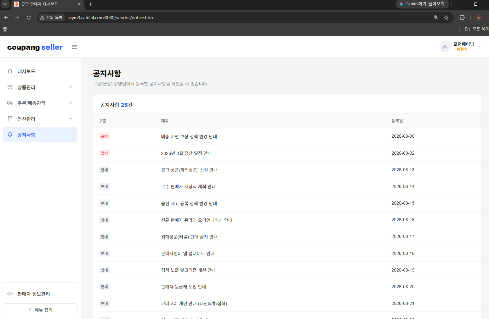

### 13. 관리자 대시보드

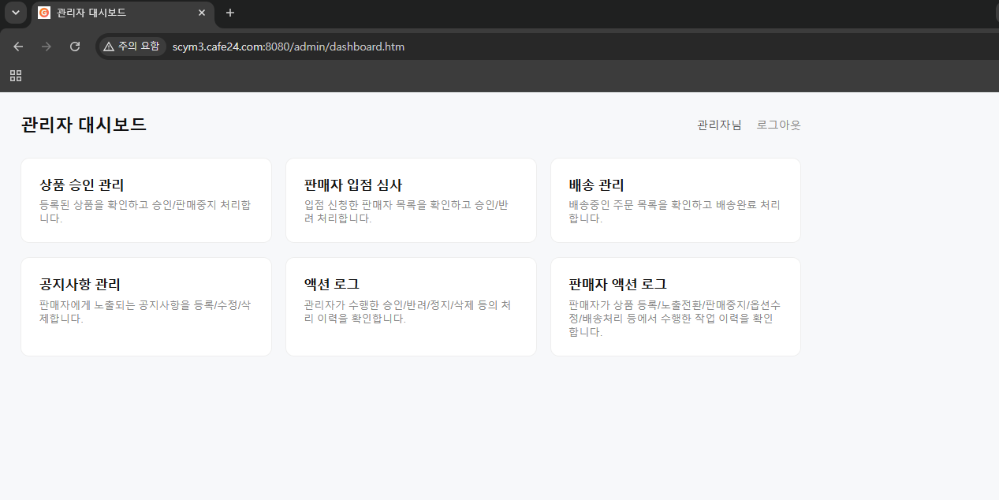

### 14. 관리자 - 상품 목록

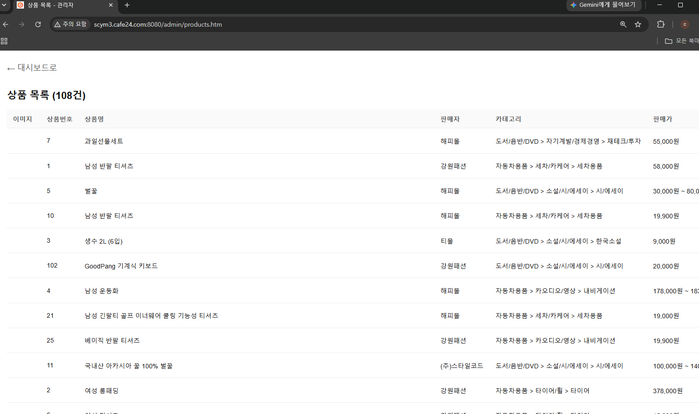

### 15. 관리자 - 판매자 목록

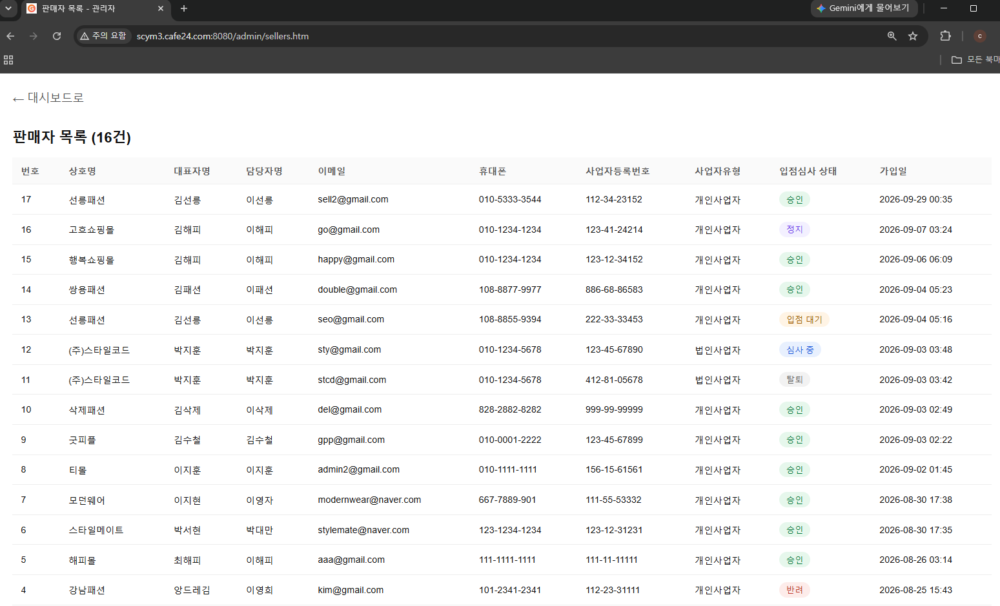

