# 쿠팡 판매자 상품등록 화면 캡처

> UX/기능 구조 참고용 캡처. 브랜드/로고/실제 데이터는 자체 목업으로 대체하며, 레이아웃과 진행 단계 구조만 참고한다.

1. 판매자 메뉴
   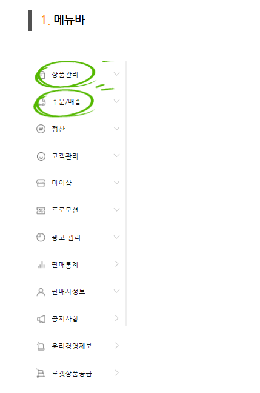

2. 상품등록 01
   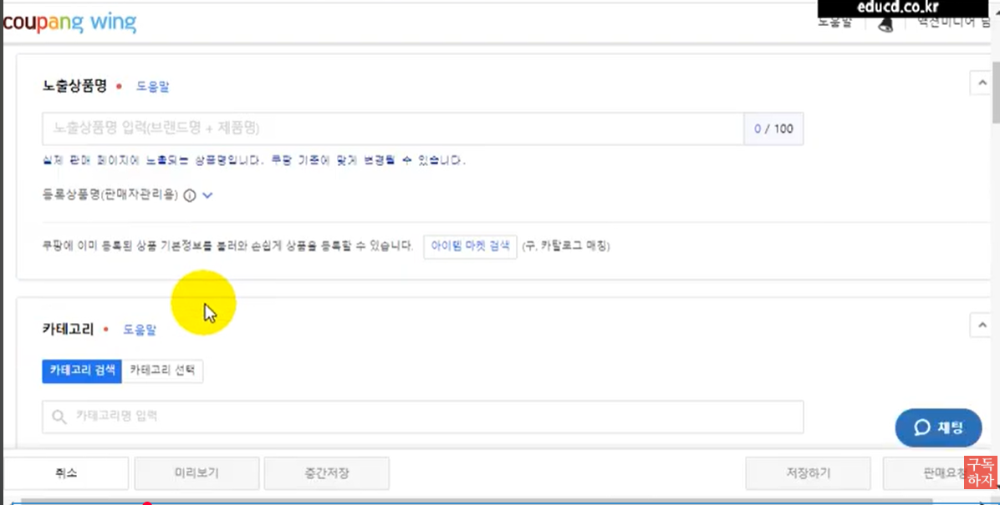

3. 상품등록 02
   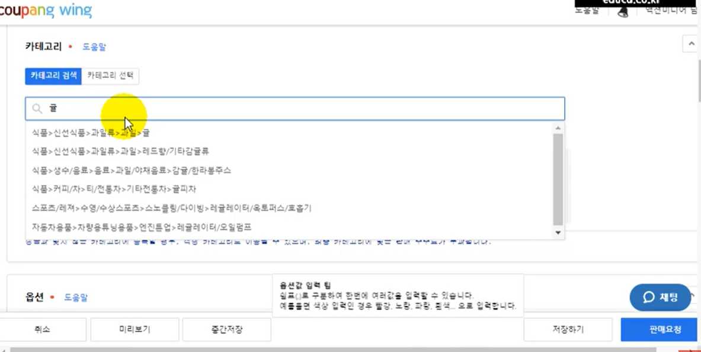

4. 상품등록 03
   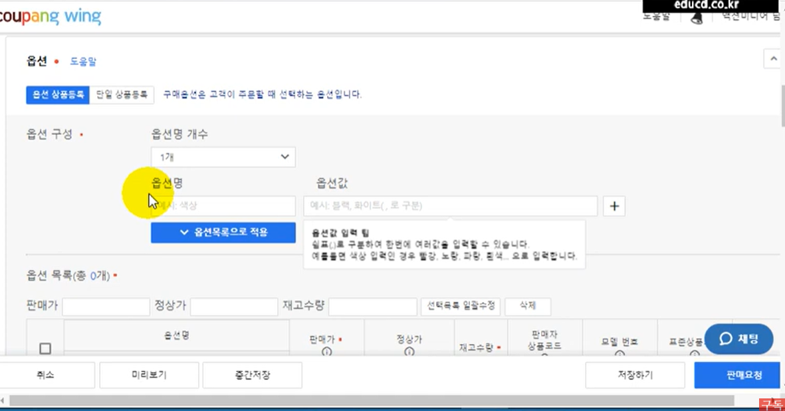

5. 상품등록 04
   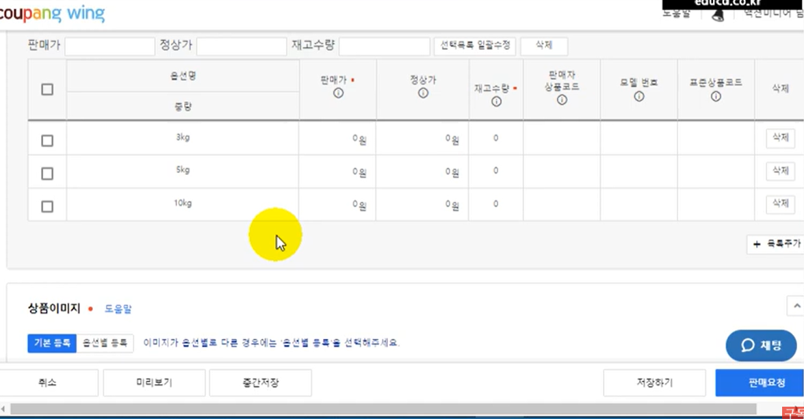

6. 상품등록 05
   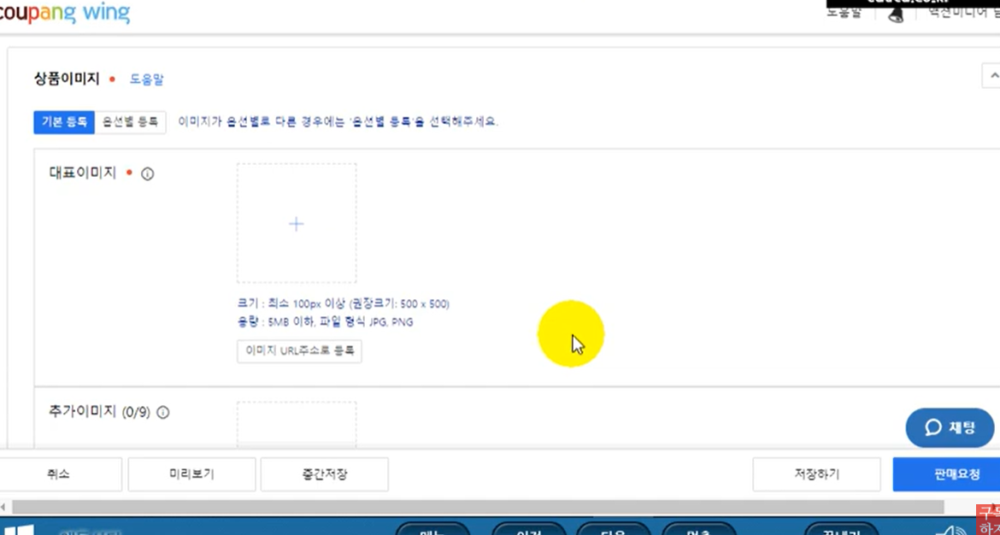

7. 상품등록 06
   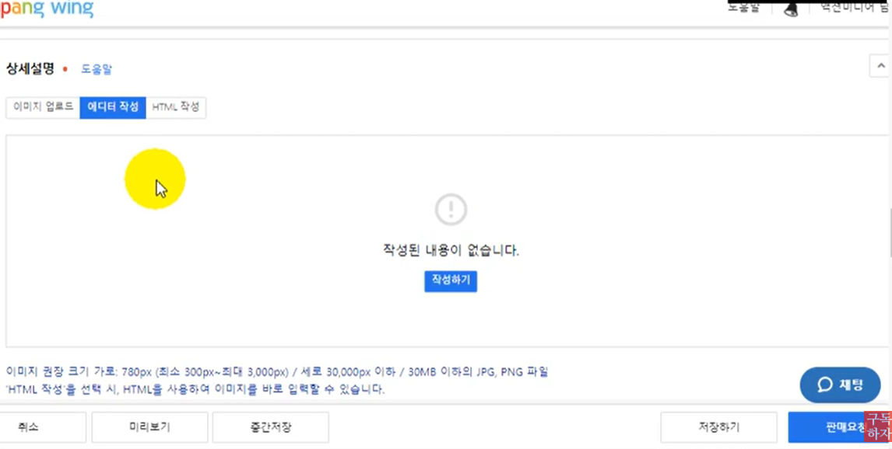

8. 상품등록 07
   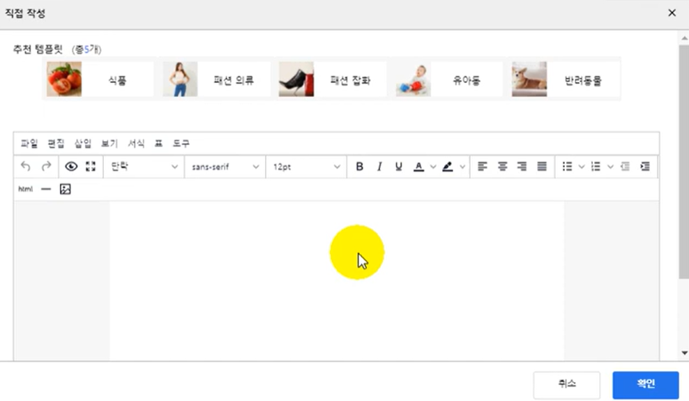

9. 상품등록 08
   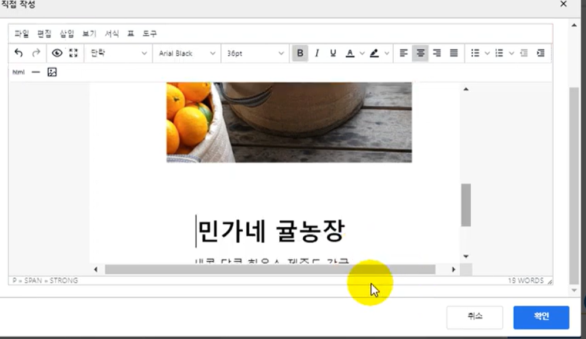

10. 상품등록 09
    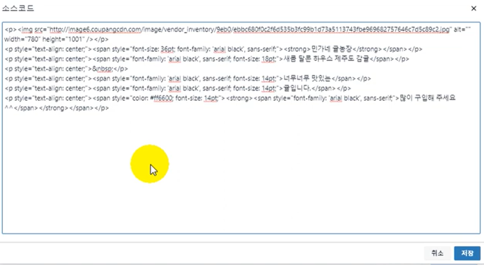

11. 상품등록 10
    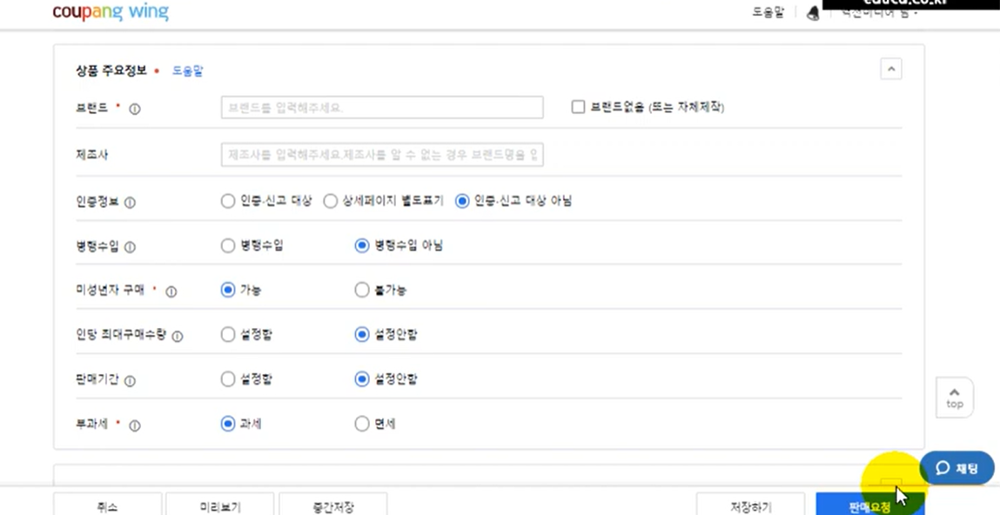

12. 상품등록 11
    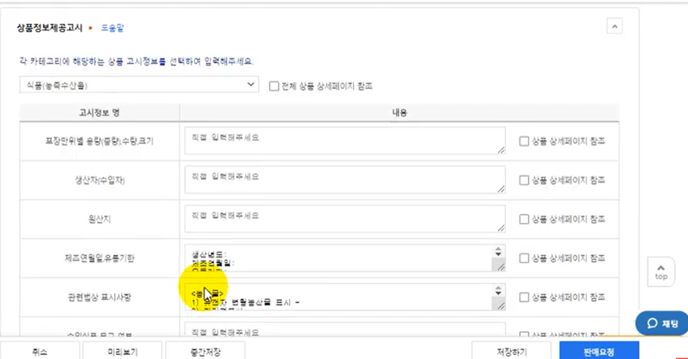

13. 상품등록 12
    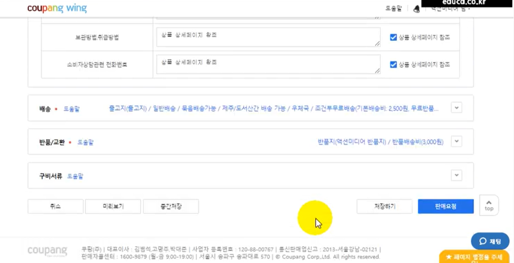

14. 상품등록 13
    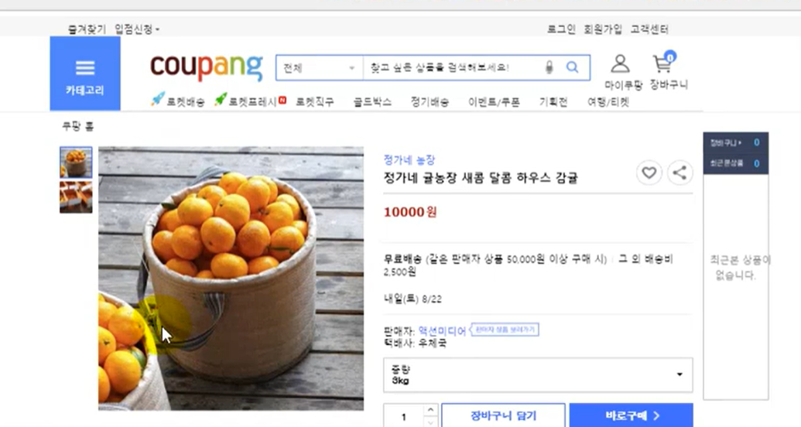

15. 상품등록 14
    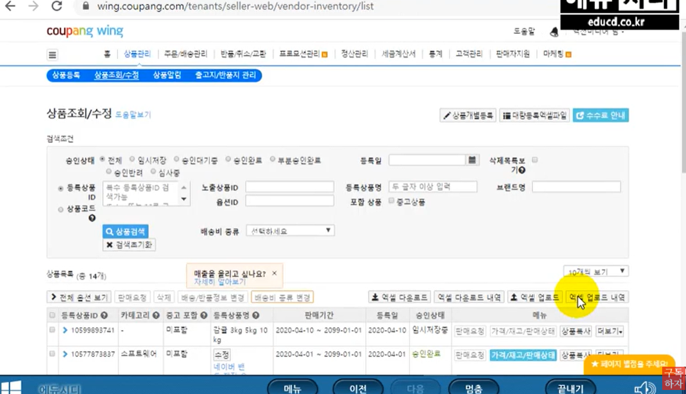
