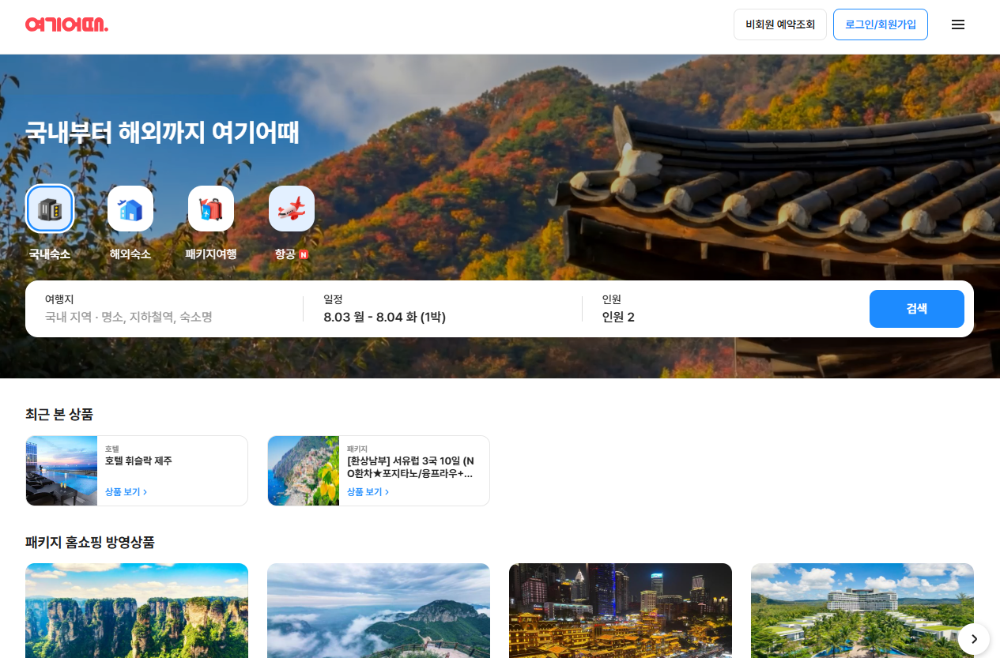
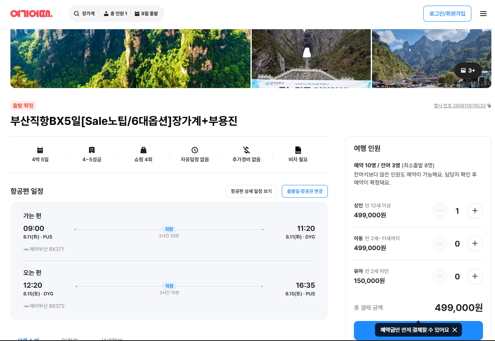

# 스토리보드 - 숙박예약 플랫폼 (여기어때 클론)

> 참고 사이트: www.yeogi.com (UX/기능 구조 참고, 브랜드/로고/실제 데이터는 미사용 — 자체 목업으로 대체)
> 작성 기준: 8주 로드맵의 Core + Extended 범위 (회원, 검색/필터, 예약, 결제, 리뷰, 쿠폰, 타임세일, 사장님 어드민, 정산 배치)
> 프론트 비중은 낮추고 백엔드 로직(동시성 제어, 트랜잭션, 정산 배치 등)을 화면과 1:1로 연결해 표시함
> 실제로 여러 단계로 진행되는 플로우(로그인/가입, 예약, 결제, 취소, 쿠폰, 파트너 등록/승인 등)는 단계별 화면으로 세분화함

---

## 0. 참고: 여기어때 실제 화면 캡처

> UX/기능 구조 참고용 캡처. 브랜드/로고/실제 데이터는 자체 목업으로 대체하며, 레이아웃 구조만 참고한다.

| 캡처 | 대응 화면 |
|---|---|
|  | S01. 홈 — 검색바(지역/날짜/인원), 카테고리 탭, 추천 상품 리스트 구조 참고 |
|  | S03-1. 숙소 상세 — 이미지 갤러리, 상품 요약 정보, 인원/가격 선택 영역 구조 참고 |

---

## 1. 사용자 유형

| 유형 | 설명 |
|---|---|
| 일반회원 (Guest/User) | 숙소 검색, 예약, 결제, 리뷰 작성 |
| 사장님 (Partner) | 숙소/객실 등록, 예약 관리, 정산 확인 |
| 관리자 (Admin) | 회원/숙소/리뷰 관리, 통계 |

---

## 2. 전체 화면 흐름도 (텍스트)

```
[인증 (로그인/회원가입) - 아래 모든 플로우 진입 전 필요]
시작화면(S00-1)
 ├▶ 이메일 로그인 입력(S00-2) ─(실패)─▶ 인라인 에러, 화면 유지
 │        └▶(비밀번호 찾기)▶ 계정확인(S00-3) ▶ 인증코드확인(S00-4) ▶ 비밀번호 재설정(S00-5) ▶ S00-2로 복귀
 ├▶ 회원가입-약관동의(S00-6)
 │        └▶ 이메일 인증(S00-7, Extended)
 │              └▶ 정보입력(S00-8)
 │                    └▶ 가입완료(S00-9) ─▶ 로그인(S00-2) 또는 자동로그인 후 홈(S01)
 └▶ 소셜 로그인(S00-10, Stretch) ─▶ (최초 가입자) 정보입력 일부(S00-8) ─▶ 홈(S01)


[일반회원 - 핵심 예약 플로우]
1. 홈(S01)
2. 검색결과 리스트(S02-1) ⇄ 상세 필터 설정(S02-2)
3. 숙소 상세(S03-1) → 이미지 전체보기(S03-2) / 리뷰 전체보기(S03-3) / 위치보기(S03-4, Stretch)
4. 객실 선택(S04-1)
5. 예약자 정보입력(S04-2)
6. 쿠폰/포인트 적용(S04-3, Extended) → 쿠폰함(S10-1/S10-2)으로 이동 가능
7. 예약 최종확인(S04-4)
8. 결제수단 선택(S05-1)
9. 결제 진행(S05-2) → 결제처리중(S05-3)
   - 성공 → 10. 예약완료(S06)
   - 실패 → 결제실패(S05-4) → 8번으로 재시도
10. 예약완료(S06)
11. 마이페이지-예약내역(S07)
12. 예약 상세보기(S08-1)
    - 취소 진행 시: 취소사유 선택(S08-2) → 취소/환불 안내(S08-3) → 취소완료(S08-4)
    - 리뷰 작성 시(이용완료 건): 리뷰작성(S09-1) → 작성완료(S09-2)

[보조 플로우]
타임세일 목록(S11) ─▶ 숙소 상세(S03-1)
쿠폰함: 보유쿠폰(S10-1) ⇄ 발급가능쿠폰(S10-2) ─(발급)─▶ 발급완료(S10-3)


[사장님]
파트너 로그인(S12) ─▶ 파트너 대시보드(S13)
 ├▶ 숙소 등록: 기본정보(S14-1) → 위치(S14-2) → 편의시설(S14-3) → 이미지업로드(S14-4) → 등록완료/심사대기(S14-5)
 ├▶ 객실 관리: 객실목록(S15-1) → 등록/수정 폼(S15-2) → 날짜별 재고 캘린더(S15-3)
 ├▶ 타임세일 등록: 대상객실 선택(S16-1) → 할인조건 설정(S16-2) → 등록완료(S16-3)
 ├▶ 예약 관리: 예약 리스트(S17-1) → 예약 상세(S17-2) → 상태변경 확인(S17-3)
 └▶ 정산: 정산 요약(S18-1) → 정산 상세 리스트(S18-2)


[관리자]
관리자 로그인(S19) ─▶ 관리자 대시보드
 ├▶ 회원 관리: 회원 리스트(S20-1) → 회원 상세/상태변경(S20-2)
 ├▶ 숙소 승인 관리: 대기 리스트(S21-1) → 상세 검토(S21-2) → 승인/반려 처리(S21-3)
 ├▶ 리뷰/신고 관리: 신고 리스트(S22-1) → 신고 상세/처리(S22-2)
 └▶ 통계 대시보드(S23)
```

---

## 3. 화면 목록 (우선순위 요약)

| 번호 | 화면명 | 사용자유형 | 우선순위 |
|---|---|---|---|
| S00-1 | 시작화면 (로그인 방식 선택) | 공통 | Core |
| S00-2 | 이메일 로그인 입력 | 공통 | Core |
| S00-3 | 비밀번호 찾기 - 계정 확인 | 공통 | Extended |
| S00-4 | 비밀번호 찾기 - 인증코드 확인 | 공통 | Extended |
| S00-5 | 비밀번호 재설정 | 공통 | Extended |
| S00-6 | 회원가입 - 약관동의 | 공통 | Core |
| S00-7 | 회원가입 - 이메일 인증 | 공통 | Extended |
| S00-8 | 회원가입 - 정보입력 | 공통 | Core |
| S00-9 | 회원가입 완료 | 공통 | Core |
| S00-10 | 소셜 로그인 연동 | 공통 | Stretch |
| S01 | 홈 | 일반회원 | Core |
| S02-1 | 검색결과 리스트 | 일반회원 | Core |
| S02-2 | 상세 필터 설정 | 일반회원 | Core |
| S03-1 | 숙소 상세 (메인) | 일반회원 | Core |
| S03-2 | 이미지 전체보기 | 일반회원 | Extended |
| S03-3 | 리뷰 전체보기 | 일반회원 | Extended |
| S03-4 | 위치/지도 보기 | 일반회원 | Stretch |
| S04-1 | 객실 선택 | 일반회원 | Core |
| S04-2 | 예약자 정보입력 | 일반회원 | Core |
| S04-3 | 쿠폰/포인트 적용 | 일반회원 | Extended |
| S04-4 | 예약 최종확인 | 일반회원 | Core |
| S05-1 | 결제수단 선택 | 일반회원 | Extended |
| S05-2 | 결제 진행 | 일반회원 | Extended |
| S05-3 | 결제 처리중 | 일반회원 | Extended |
| S05-4 | 결제 실패 | 일반회원 | Extended |
| S06 | 예약완료 | 일반회원 | Core |
| S07 | 마이페이지-예약내역 | 일반회원 | Core |
| S08-1 | 예약 상세보기 | 일반회원 | Core |
| S08-2 | 취소 사유 선택 | 일반회원 | Core |
| S08-3 | 취소/환불 안내 확인 | 일반회원 | Core |
| S08-4 | 취소 완료 | 일반회원 | Core |
| S09-1 | 리뷰 작성 | 일반회원 | Core |
| S09-2 | 리뷰 작성 완료 | 일반회원 | Core |
| S10-1 | 보유 쿠폰함 | 일반회원 | Extended |
| S10-2 | 발급 가능 쿠폰 목록 | 일반회원 | Extended |
| S10-3 | 쿠폰 발급 완료 | 일반회원 | Extended |
| S11 | 타임세일 목록 | 일반회원 | Extended |
| S12 | 파트너 로그인 | 사장님 | Extended |
| S13 | 파트너 대시보드 | 사장님 | Extended |
| S14-1 | 숙소 등록 - 기본정보 | 사장님 | Extended |
| S14-2 | 숙소 등록 - 위치 | 사장님 | Extended |
| S14-3 | 숙소 등록 - 편의시설 | 사장님 | Extended |
| S14-4 | 숙소 등록 - 이미지 업로드 | 사장님 | Extended |
| S14-5 | 숙소 등록 완료 (심사 대기) | 사장님 | Extended |
| S15-1 | 객실 목록 | 사장님 | Extended |
| S15-2 | 객실 등록/수정 폼 | 사장님 | Extended |
| S15-3 | 날짜별 재고 캘린더 | 사장님 | Extended |
| S16-1 | 타임세일 - 대상 객실 선택 | 사장님 | Extended |
| S16-2 | 타임세일 - 할인조건 설정 | 사장님 | Extended |
| S16-3 | 타임세일 등록 완료 | 사장님 | Extended |
| S17-1 | 예약 리스트 | 사장님 | Extended |
| S17-2 | 예약 상세 | 사장님 | Extended |
| S17-3 | 상태 변경 확인 | 사장님 | Extended |
| S18-1 | 정산 요약 | 사장님 | Extended (Stretch에 가까움) |
| S18-2 | 정산 상세 리스트 | 사장님 | Extended (Stretch에 가까움) |
| S19 | 관리자 로그인 | 관리자 | Stretch |
| S20-1 | 회원 리스트 | 관리자 | Stretch |
| S20-2 | 회원 상세/상태변경 | 관리자 | Stretch |
| S21-1 | 숙소 승인 대기 리스트 | 관리자 | Stretch |
| S21-2 | 숙소 상세 검토 | 관리자 | Stretch |
| S21-3 | 승인/반려 처리 | 관리자 | Stretch |
| S22-1 | 신고 리스트 | 관리자 | Stretch |
| S22-2 | 신고 상세/처리 | 관리자 | Stretch |
| S23 | 통계 대시보드 | 관리자 | Stretch |

---

## 4. 화면별 상세 스토리보드

### S00-1. 시작화면 (로그인 방식 선택)
- **목적**: 인증 플로우의 진입점, 로그인/회원가입/소셜로그인 분기
- **주요 UI 요소**: "이메일로 로그인" 버튼, "회원가입" 버튼, (Stretch) 카카오/네이버/구글 로그인 버튼
- **사용자 액션 → 이동**: 이메일로 로그인 → S00-2 / 회원가입 → S00-6 / 소셜 로그인 → S00-10
- **관련 백엔드**: 없음 (라우팅 전용 화면)

### S00-2. 이메일 로그인 입력
- **목적**: 이메일/비밀번호 기반 로그인, 토큰 발급
- **주요 UI 요소**: 이메일 입력, 비밀번호 입력, 로그인 버튼, "비밀번호를 잊으셨나요?" 링크, 자동로그인 체크박스
- **사용자 액션 → 이동**: 로그인 성공 → 홈(S01) / 실패 → 화면 유지하며 인라인 에러("이메일 또는 비밀번호가 일치하지 않습니다") / 비밀번호 찾기 클릭 → S00-3
- **관련 백엔드**: `POST /api/auth/login`, Spring Security + JWT(Access/Refresh Token) 발급, (선택) 로그인 실패 횟수 제한

### S00-3. 비밀번호 찾기 - 계정 확인
- **목적**: 비밀번호 재설정을 위한 본인 계정 확인
- **주요 UI 요소**: 가입 이메일 입력, "인증코드 받기" 버튼
- **사용자 액션 → 이동**: 발송 성공 → S00-4 / 미가입 이메일 → 인라인 에러
- **관련 백엔드**: `POST /api/auth/password/find`, 가입 여부 확인 후 이메일로 인증코드 발송

### S00-4. 비밀번호 찾기 - 인증코드 확인
- **목적**: 이메일로 받은 인증코드 검증
- **주요 UI 요소**: 인증코드 입력창, 남은 시간 타이머, 재발송 버튼
- **사용자 액션 → 이동**: 인증 성공 → S00-5 / 실패·만료 → 에러 메시지, 재발송 유도
- **관련 백엔드**: `POST /api/auth/password/verify`, 인증코드 및 만료시각을 DB 테이블에 저장·검증(Redis 미사용이므로 `password_reset_token` 테이블 등으로 대체)

### S00-5. 비밀번호 재설정
- **목적**: 신규 비밀번호로 변경
- **주요 UI 요소**: 신규 비밀번호 입력, 비밀번호 확인 입력, 유효성 안내(자릿수/특수문자 등)
- **사용자 액션 → 이동**: 변경 완료 → 안내 메시지 후 S00-2(로그인 화면)로 이동
- **관련 백엔드**: `PATCH /api/auth/password/reset`, BCrypt 암호화 저장, 사용된 인증코드 즉시 만료 처리

### S00-6. 회원가입 - 약관동의
- **목적**: 서비스 이용약관/개인정보 처리방침 동의
- **주요 UI 요소**: 전체동의 체크박스, 필수 약관 목록(이용약관, 개인정보처리방침), 선택 약관(마케팅 수신 동의)
- **사용자 액션 → 이동**: 필수 약관 동의 후 다음 → S00-7 (이메일 인증 생략 시 S00-8로 바로 이동 가능)
- **관련 백엔드**: 없음 (동의 여부는 프론트 상태로 유지 후 가입 API 호출 시 함께 전송)

### S00-7. 회원가입 - 이메일 인증 (Extended)
- **목적**: 이메일 소유 여부 확인
- **주요 UI 요소**: 이메일 입력, "인증코드 발송" 버튼, 인증코드 입력창
- **사용자 액션 → 이동**: 인증 완료 → S00-8
- **관련 백엔드**: `POST /api/auth/email/verify`, 인증코드 만료시간 관리(DB 테이블)
- **참고**: 휴대폰(SMS) 본인인증은 외부 유료 API 연동이 필요해 학원 프로젝트 범위에선 부담이 큼 → 이메일 인증으로 대체하거나, 정 필요하면 인증번호를 콘솔/로그에 출력하는 목(mock) 방식으로 단순화 추천

### S00-8. 회원가입 - 정보입력
- **목적**: 계정 생성에 필요한 정보 입력
- **주요 UI 요소**: 이메일(인증 완료 시 자동 채움), 비밀번호, 비밀번호 확인, 닉네임, 휴대폰번호(선택)
- **사용자 액션 → 이동**: 가입하기 → S00-9 / 이메일 중복·형식 오류 시 인라인 에러
- **관련 백엔드**: `POST /api/auth/signup`, 이메일 중복 검증(unique 제약 + 사전 체크 API), 비밀번호 BCrypt 암호화

### S00-9. 회원가입 완료
- **목적**: 가입 완료 안내 및 후속 액션 유도
- **주요 UI 요소**: 완료 메시지, (Extended) 웰컴 쿠폰 지급 안내, "로그인하기"/"홈으로" 버튼
- **사용자 액션 → 이동**: 로그인하기 → S00-2 / 홈으로(자동로그인 처리 시) → 홈(S01)
- **관련 백엔드**: 가입 완료 시 웰컴 쿠폰 자동 발급(Extended, S10-1 쿠폰함과 연동)

### S00-10. 소셜 로그인 연동 (Stretch)
- **목적**: OAuth2 기반 간편 로그인/가입
- **주요 UI 요소**: 카카오/네이버/구글 로그인 버튼 → 각 제공자 인증 페이지로 리다이렉트
- **사용자 액션 → 이동**: 인증 성공 시 최초 가입자는 추가 정보 입력(S00-8 일부 항목만) → 홈(S01) / 기존 회원은 바로 → 홈(S01)
- **관련 백엔드**: Spring Security OAuth2 Client, 최초 로그인 시 회원 자동 생성 및 소셜 계정 연동 테이블 관리

### S01. 홈
- **목적**: 서비스 진입점, 카테고리/프로모션 노출
- **주요 UI 요소**: 검색바(지역/날짜/인원), 카테고리 탭(호텔/모텔/펜션 등 — 범위 축소 시 "숙소" 단일로 단순화 가능), 타임세일 배너, 추천 숙소 리스트
- **사용자 액션 → 이동**: 검색 실행 → 검색결과 리스트(S02-1) / 타임세일 배너 클릭 → 타임세일 목록(S11) / 추천숙소 클릭 → 숙소 상세(S03-1)
- **관련 백엔드**: `GET /api/accommodations/recommend`, `GET /api/timesales/active`

### S02-1. 검색결과 리스트
- **목적**: 기본 조건(지역/날짜/인원)에 맞는 숙소 목록 탐색
- **주요 UI 요소**: 정렬(가격순/인기순/평점순), 페이징, 숙소 카드(썸네일/이름/가격/평점), "필터" 버튼
- **사용자 액션 → 이동**: 숙소 카드 클릭 → 숙소 상세(S03-1) / "필터" 버튼 → 상세 필터 설정(S02-2)
- **관련 백엔드**: `GET /api/accommodations/search` (QueryDSL 동적 쿼리, 페이징)

### S02-2. 상세 필터 설정
- **목적**: 가격대/편의시설/숙소유형 등 세부 조건 설정
- **주요 UI 요소**: 가격 범위 슬라이더, 편의시설 체크박스, 숙소유형 체크박스, "적용" / "초기화" 버튼
- **사용자 액션 → 이동**: 적용 → S02-1로 복귀, 조건 반영해 리스트 재조회
- **관련 백엔드**: 별도 API 없음, 필터 조건을 쿼리 파라미터로 S02-1의 검색 API에 함께 전달

### S03-1. 숙소 상세 (메인)
- **목적**: 숙소 기본 정보, 객실 목록, 리뷰 요약 확인
- **주요 UI 요소**: 대표 이미지 + "사진 더보기", 숙소명/설명, 편의시설 아이콘, 객실 목록(가격/잔여여부), 평점 요약 + "리뷰 더보기", 위치 요약 + "지도보기"
- **사용자 액션 → 이동**: 사진 더보기 → S03-2 / 리뷰 더보기 → S03-3 / 지도보기 → S03-4 / 객실 선택 → S04-1
- **관련 백엔드**: `GET /api/accommodations/{id}`, `GET /api/accommodations/{id}/rooms`

### S03-2. 이미지 전체보기
- **목적**: 숙소 이미지 갤러리 전체 확인
- **주요 UI 요소**: 이미지 슬라이더/그리드
- **사용자 액션 → 이동**: 뒤로가기 → S03-1
- **관련 백엔드**: 없음 (S03-1 조회 시 이미지 목록 함께 수신)

### S03-3. 리뷰 전체보기
- **목적**: 전체 리뷰 목록 확인
- **주요 UI 요소**: 평점별 필터, 리뷰 리스트(페이징)
- **사용자 액션 → 이동**: 뒤로가기 → S03-1
- **관련 백엔드**: `GET /api/accommodations/{id}/reviews` (페이징)

### S03-4. 위치/지도 보기 (Stretch)
- **목적**: 숙소 위치 확인
- **주요 UI 요소**: 지도(카카오맵/네이버맵 API), 주소, 대중교통 안내(선택)
- **사용자 액션 → 이동**: 뒤로가기 → S03-1
- **관련 백엔드**: 좌표는 숙소 등록(S14-2) 시 저장된 값 사용. 지도 API 연동이 부담되면 주소 텍스트만 노출하는 것으로 축소 가능

### S04-1. 객실 선택
- **목적**: 예약할 객실 타입 선택
- **주요 UI 요소**: 객실 카드(이름/정원/가격/잔여수량), 날짜 재확인
- **사용자 액션 → 이동**: 선택 → S04-2
- **관련 백엔드**: `GET /api/rooms/{id}/availability`, 잔여 없음 시 선택 비활성화

### S04-2. 예약자 정보입력
- **목적**: 예약자 이름/연락처/요청사항 입력
- **주요 UI 요소**: 예약자명, 연락처, 요청사항 텍스트박스
- **사용자 액션 → 이동**: 다음 → S04-3
- **관련 백엔드**: 없음 (다음 단계로 값 전달, 최종 제출 시 함께 저장)

### S04-3. 쿠폰/포인트 적용 (Extended)
- **목적**: 보유 쿠폰/포인트를 적용해 결제금액 조정
- **주요 UI 요소**: 적용 가능 쿠폰 리스트, 포인트 입력, 예상 결제금액 갱신
- **사용자 액션 → 이동**: 적용 → S04-4 / 쿠폰 더보기 → 쿠폰함(S10-1)
- **관련 백엔드**: 쿠폰 유효성(사용기한/최소금액 조건) 검증 로직

### S04-4. 예약 최종확인
- **목적**: 예약 정보 최종 검토 및 취소정책 동의
- **주요 UI 요소**: 숙소/객실/날짜/인원/금액 요약, 취소정책 안내, 동의 체크박스, "결제하기" 버튼
- **사용자 액션 → 이동**: 결제하기 → S05-1
- **관련 백엔드**: 예약 임시 생성(PENDING) 처리, 객실 재고 비관적 락(`SELECT ... FOR UPDATE`) 적용 지점 — 동시 예약 방지의 핵심 구현 포인트

### S05-1. 결제수단 선택
- **목적**: 결제 방식 선택
- **주요 UI 요소**: 카드/간편결제 등 결제수단 리스트, 최종 결제금액
- **사용자 액션 → 이동**: 선택 후 결제 진행 → S05-2
- **관련 백엔드**: 없음 (다음 단계로 전달)

### S05-2. 결제 진행
- **목적**: PG사 결제창을 통한 실제 결제 처리
- **주요 UI 요소**: 결제 정보 입력(테스트 카드) 또는 PG 리다이렉트 화면
- **사용자 액션 → 이동**: 결제 요청 → S05-3
- **관련 백엔드**: `POST /api/payments`, 토스페이먼츠 테스트 연동

### S05-3. 결제 처리중
- **목적**: 결제 승인 대기 상태 표시
- **주요 UI 요소**: 로딩 스피너, "결제 처리 중입니다" 안내
- **사용자 액션 → 이동**: 성공 콜백 → 예약완료(S06) / 실패 콜백 → 결제실패(S05-4)
- **관련 백엔드**: 결제 승인 콜백 처리, 성공 시 트랜잭션으로 예약 확정 + 재고 차감 원자적 처리

### S05-4. 결제 실패
- **목적**: 결제 실패 사유 안내 및 재시도 유도
- **주요 UI 요소**: 실패 사유, "다시 시도" 버튼, "다른 결제수단 선택" 버튼
- **사용자 액션 → 이동**: 재시도 → S05-1
- **관련 백엔드**: 실패 로그 기록, 임시 예약 데이터 롤백

### S06. 예약완료
- **목적**: 예약 확정 안내
- **주요 UI 요소**: 예약번호, 숙소/객실 정보 요약, 마이페이지 이동 버튼
- **사용자 액션 → 이동**: 마이페이지-예약내역(S07)
- **관련 백엔드**: 예약 확정 이메일 발송(Extended)

### S07. 마이페이지-예약내역
- **목적**: 내 예약 목록 확인
- **주요 UI 요소**: 예약 상태별 탭(예정/완료/취소), 예약 카드 리스트
- **사용자 액션 → 이동**: 예약 클릭 → 예약 상세보기(S08-1)
- **관련 백엔드**: `GET /api/reservations/me`

### S08-1. 예약 상세보기
- **목적**: 예약 상세 정보 확인
- **주요 UI 요소**: 예약 상세 정보, 취소정책 안내, "취소하기" 버튼, "리뷰작성" 버튼(이용완료 건만 노출)
- **사용자 액션 → 이동**: 취소하기 → S08-2 / 리뷰작성 → S09-1
- **관련 백엔드**: `GET /api/reservations/{id}`

### S08-2. 취소 사유 선택
- **목적**: 취소 사유 입력
- **주요 UI 요소**: 취소 사유 라디오버튼(단순변심/일정변경 등), 상세사유 텍스트박스(선택)
- **사용자 액션 → 이동**: 다음 → S08-3
- **관련 백엔드**: 없음 (다음 단계로 전달)

### S08-3. 취소/환불 안내 확인
- **목적**: 환불 금액 및 취소 정책 최종 확인
- **주요 UI 요소**: 환불 예정 금액, 취소 수수료 안내, "취소 확정" 버튼
- **사용자 액션 → 이동**: 취소 확정 → S08-4
- **관련 백엔드**: 취소 시점 기준 환불액 계산 로직(정책별 수수료율 적용)

### S08-4. 취소 완료
- **목적**: 취소 처리 완료 안내
- **주요 UI 요소**: 완료 메시지, 환불 예정일 안내, "예약내역으로" 버튼
- **사용자 액션 → 이동**: → 마이페이지-예약내역(S07)
- **관련 백엔드**: `DELETE /api/reservations/{id}`(또는 상태 변경), 트랜잭션 처리로 재고 복구

### S09-1. 리뷰 작성
- **목적**: 이용 완료 숙소에 대한 리뷰 등록
- **주요 UI 요소**: 별점 입력, 텍스트 입력, 이미지 첨부(선택)
- **사용자 액션 → 이동**: 등록 → S09-2
- **관련 백엔드**: `POST /api/reviews`, 예약 완료 이력 검증 후에만 작성 허용

### S09-2. 리뷰 작성 완료
- **목적**: 작성 완료 안내
- **주요 UI 요소**: 완료 메시지, "숙소 보러가기" / "예약내역으로" 버튼
- **사용자 액션 → 이동**: 숙소 상세(S03-1) 또는 마이페이지-예약내역(S07)
- **관련 백엔드**: 없음

### S10-1. 보유 쿠폰함
- **목적**: 내가 보유한 쿠폰 확인
- **주요 UI 요소**: 탭(보유쿠폰/발급가능쿠폰), 보유 쿠폰 리스트(할인조건/유효기간)
- **사용자 액션 → 이동**: 발급가능쿠폰 탭 → S10-2
- **관련 백엔드**: `GET /api/coupons/me`

### S10-2. 발급 가능 쿠폰 목록
- **목적**: 신규 발급 가능한 쿠폰(선착순 포함) 확인
- **주요 UI 요소**: 발급 가능 쿠폰 리스트, 잔여 수량 표시, "발급받기" 버튼
- **사용자 액션 → 이동**: 발급받기 → S10-3
- **관련 백엔드**: `POST /api/coupons/{id}/issue`, DB 락 기반 선착순 발급 동시성 제어(수량 컬럼 비관적 락 또는 낙관적 락+재시도)

### S10-3. 쿠폰 발급 완료
- **목적**: 발급 결과 안내
- **주요 UI 요소**: 발급 성공 메시지 또는 "이미 소진되었습니다" 실패 메시지
- **사용자 액션 → 이동**: 확인 → S10-1
- **관련 백엔드**: 없음 (발급 API 응답 결과 표시)

### S11. 타임세일 목록
- **목적**: 진행 중인 특가 숙소 노출
- **주요 UI 요소**: 남은시간 카운트다운, 특가 숙소 카드, 잔여 수량 표시
- **사용자 액션 → 이동**: 카드 클릭 → 숙소 상세(S03-1)
- **관련 백엔드**: `GET /api/timesales/active`, 예약 시점 재고 차감 동시성 제어(이 프로젝트의 백엔드 핵심 데모 지점)

### S12. 파트너 로그인
- **목적**: 사장님 계정 로그인
- **주요 UI 요소**: 로그인 폼(일반 로그인과 계정 유형만 다름)
- **사용자 액션 → 이동**: 로그인 성공 → 파트너 대시보드(S13)
- **관련 백엔드**: 역할 기반 인가(ROLE_PARTNER)

### S13. 파트너 대시보드
- **목적**: 예약 현황/매출 요약 확인
- **주요 UI 요소**: 오늘 체크인/체크아웃 건수, 최근 예약 리스트, 매출 요약 카드
- **사용자 액션 → 이동**: 각 카드 클릭 → 숙소관리(S14-1)/객실관리(S15-1)/예약관리(S17-1)/정산(S18-1)
- **관련 백엔드**: `GET /api/partner/dashboard`

### S14-1. 숙소 등록 - 기본정보
- **목적**: 숙소명/유형/소개 입력
- **주요 UI 요소**: 숙소명, 숙소유형(호텔/모텔/펜션 등), 소개글
- **사용자 액션 → 이동**: 다음 → S14-2
- **관련 백엔드**: 없음 (다음 단계로 전달, 최종 제출 시 저장)

### S14-2. 숙소 등록 - 위치
- **목적**: 주소 및 좌표 입력
- **주요 UI 요소**: 주소 검색(우편번호 API), 상세주소, 지도 좌표 확인(Stretch)
- **사용자 액션 → 이동**: 다음 → S14-3
- **관련 백엔드**: 주소 검색은 다음(Daum) 우편번호 API 등 무료 API로 대체 가능

### S14-3. 숙소 등록 - 편의시설
- **목적**: 제공 편의시설 선택
- **주요 UI 요소**: 편의시설 체크박스(주차/조식/수영장 등)
- **사용자 액션 → 이동**: 다음 → S14-4
- **관련 백엔드**: 없음

### S14-4. 숙소 등록 - 이미지 업로드
- **목적**: 숙소 대표/상세 이미지 등록
- **주요 UI 요소**: 이미지 업로드(드래그앤드롭), 대표이미지 지정
- **사용자 액션 → 이동**: 등록 → S14-5
- **관련 백엔드**: 이미지 파일 저장(로컬 또는 S3), `POST /api/partner/accommodations`

### S14-5. 숙소 등록 완료 (심사 대기 안내)
- **목적**: 등록 완료 및 관리자 승인 대기 상태 안내
- **주요 UI 요소**: 완료 메시지, "심사 중입니다" 안내, "객실 등록하기" 버튼
- **사용자 액션 → 이동**: → 객실 목록(S15-1)
- **관련 백엔드**: 숙소 상태 `PENDING`으로 저장 (S21-1 승인 관리와 연동)

### S15-1. 객실 목록
- **목적**: 등록된 객실 타입 목록 확인
- **주요 UI 요소**: 객실 카드 리스트, "객실 추가" 버튼
- **사용자 액션 → 이동**: 객실 클릭/추가 → S15-2 / 재고관리 → S15-3
- **관련 백엔드**: `GET /api/partner/rooms`

### S15-2. 객실 등록/수정 폼
- **목적**: 객실 타입별 기본정보/가격 입력
- **주요 UI 요소**: 객실명, 정원, 기본가격, 이미지
- **사용자 액션 → 이동**: 저장 → S15-3(재고 설정) 또는 S15-1로 복귀
- **관련 백엔드**: `POST /api/partner/rooms`

### S15-3. 날짜별 재고 캘린더
- **목적**: 날짜별 판매 가능 수량/가격 조정
- **주요 UI 요소**: 캘린더 뷰, 날짜별 재고 수량 입력, 특정일 가격 조정(성수기 등)
- **사용자 액션 → 이동**: 저장 → S15-1
- **관련 백엔드**: 날짜별 재고 테이블 설계 필요 지점, 예약 발생 시 이 테이블과 연동해 차감

### S16-1. 타임세일 등록 - 대상 객실 선택
- **목적**: 특가 적용할 객실 선택
- **주요 UI 요소**: 보유 객실 리스트에서 선택
- **사용자 액션 → 이동**: 다음 → S16-2
- **관련 백엔드**: 없음

### S16-2. 타임세일 등록 - 할인조건 설정
- **목적**: 할인율/수량/기간 설정
- **주요 UI 요소**: 할인율 입력, 특가 수량, 시작/종료 일시
- **사용자 액션 → 이동**: 등록 → S16-3
- **관련 백엔드**: `POST /api/partner/timesales`, 스케줄러로 시작/종료 자동 처리

### S16-3. 타임세일 등록 완료
- **목적**: 등록 결과 확인
- **주요 UI 요소**: 완료 메시지, 등록 내역 요약
- **사용자 액션 → 이동**: → 파트너 대시보드(S13)
- **관련 백엔드**: 없음

### S17-1. 예약 리스트
- **목적**: 들어온 예약 목록 확인
- **주요 UI 요소**: 상태별 필터(예정/체크인/체크아웃/취소), 예약 카드 리스트
- **사용자 액션 → 이동**: 카드 클릭 → S17-2
- **관련 백엔드**: `GET /api/partner/reservations`

### S17-2. 예약 상세
- **목적**: 개별 예약 상세 확인
- **주요 UI 요소**: 예약자 정보, 객실/날짜 정보, 상태 변경 버튼(체크인 처리/취소 승인 등)
- **사용자 액션 → 이동**: 상태 변경 → S17-3
- **관련 백엔드**: `GET /api/partner/reservations/{id}`

### S17-3. 상태 변경 확인
- **목적**: 체크인/체크아웃/취소승인 등 처리 확정
- **주요 UI 요소**: 변경 내용 확인 모달, "확정" 버튼
- **사용자 액션 → 이동**: 확정 → S17-1로 복귀, 목록 갱신
- **관련 백엔드**: `PATCH /api/partner/reservations/{id}/status`

### S18-1. 정산 요약
- **목적**: 기간별 정산 금액 요약 확인
- **주요 UI 요소**: 기간 선택(월별), 총 매출/수수료/정산액 요약 카드
- **사용자 액션 → 이동**: 상세보기 → S18-2
- **관련 백엔드**: `GET /api/partner/settlements/summary`, Spring Batch 정산 배치 결과 조회

### S18-2. 정산 상세 리스트
- **목적**: 예약 건별 정산 내역 확인
- **주요 UI 요소**: 예약건-금액-수수료-정산액 리스트
- **사용자 액션 → 이동**: 다운로드(선택)
- **관련 백엔드**: `GET /api/partner/settlements`

### S19. 관리자 로그인
- **목적**: 관리자 계정 로그인
- **관련 백엔드**: 역할 기반 인가(ROLE_ADMIN)

### S20-1. 회원 리스트
- **목적**: 전체 회원 목록 조회
- **주요 UI 요소**: 검색(이메일/닉네임), 회원 리스트, 상태 표시
- **사용자 액션 → 이동**: 회원 클릭 → S20-2
- **관련 백엔드**: `GET /api/admin/members`

### S20-2. 회원 상세/상태변경
- **목적**: 회원 상세 정보 확인 및 정지/해제 처리
- **주요 UI 요소**: 회원 상세 정보, 예약 이력 요약, "정지"/"해제" 버튼
- **사용자 액션 → 이동**: 처리 → S20-1로 복귀
- **관련 백엔드**: `PATCH /api/admin/members/{id}/status`

### S21-1. 숙소 승인 대기 리스트
- **목적**: 승인 대기 중인 숙소 목록 확인
- **주요 UI 요소**: 대기 리스트, 등록일 표시
- **사용자 액션 → 이동**: 클릭 → S21-2
- **관련 백엔드**: `GET /api/admin/accommodations?status=PENDING`

### S21-2. 숙소 상세 검토
- **목적**: 등록 정보 상세 검토
- **주요 UI 요소**: 숙소 정보 전체(이미지/설명/편의시설/위치), "승인"/"반려" 버튼
- **사용자 액션 → 이동**: 승인/반려 → S21-3
- **관련 백엔드**: `GET /api/admin/accommodations/{id}`

### S21-3. 승인/반려 처리
- **목적**: 승인 또는 반려 사유 입력 후 확정
- **주요 UI 요소**: (반려 시) 반려 사유 입력창, "확정" 버튼
- **사용자 액션 → 이동**: 확정 → S21-1로 복귀
- **관련 백엔드**: `PATCH /api/admin/accommodations/{id}/approval`

### S22-1. 신고 리스트
- **목적**: 신고 접수된 리뷰 목록 확인
- **주요 UI 요소**: 신고 리스트(신고사유/신고일)
- **사용자 액션 → 이동**: 클릭 → S22-2
- **관련 백엔드**: `GET /api/admin/reports`

### S22-2. 신고 상세/처리
- **목적**: 신고 상세 확인 및 리뷰 삭제 처리
- **주요 UI 요소**: 신고된 리뷰 내용, 신고 사유, "삭제"/"반려" 버튼
- **사용자 액션 → 이동**: 처리 → S22-1로 복귀
- **관련 백엔드**: `DELETE /api/admin/reviews/{id}`

### S23. 통계 대시보드
- **목적**: 전체 서비스 매출/예약 통계 확인
- **주요 UI 요소**: 기간별 매출 그래프, 인기 숙소 TOP N
- **관련 백엔드**: `GET /api/admin/statistics`, 집계 쿼리 최적화 포인트

---

## 5. 다음 단계 제안
1. 위 화면 목록을 기준으로 팀 내에서 **Core / Extended 경계**를 재확인하고 각자 담당 화면-API 매칭
2. 화면별 ERD 연관 테이블 정리 (예: S04-4·S15-3은 "객실 재고" 테이블 설계와 직결, S00-4·S00-7은 "인증코드" 테이블과 직결)
3. Figma 또는 손그림 와이어프레임으로 각 화면 레이아웃 러프 스케치 (실제 여기어때 캡처는 참고용으로만, 자체 디자인으로 대체)
