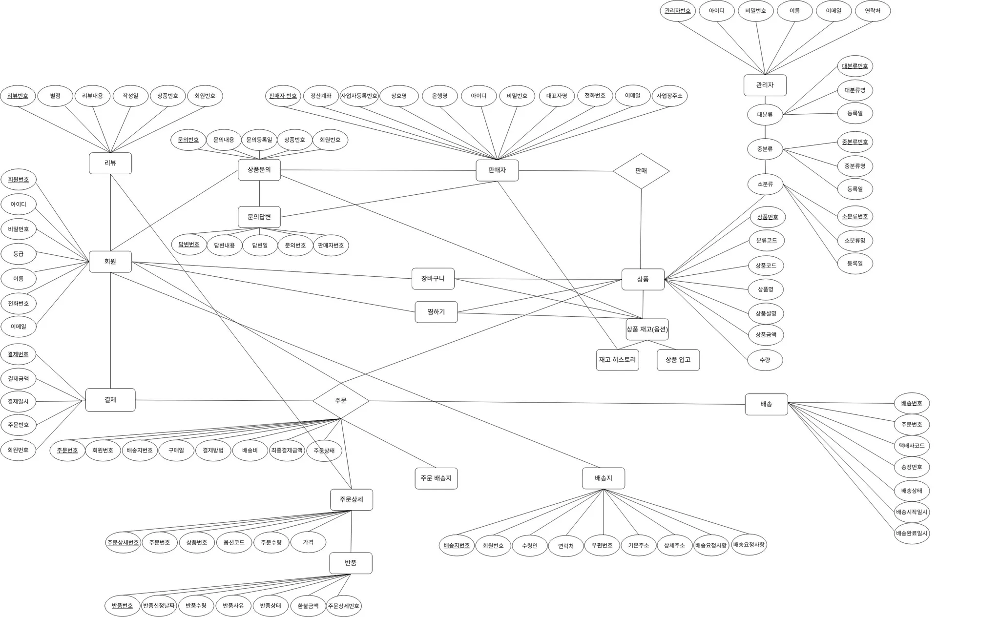
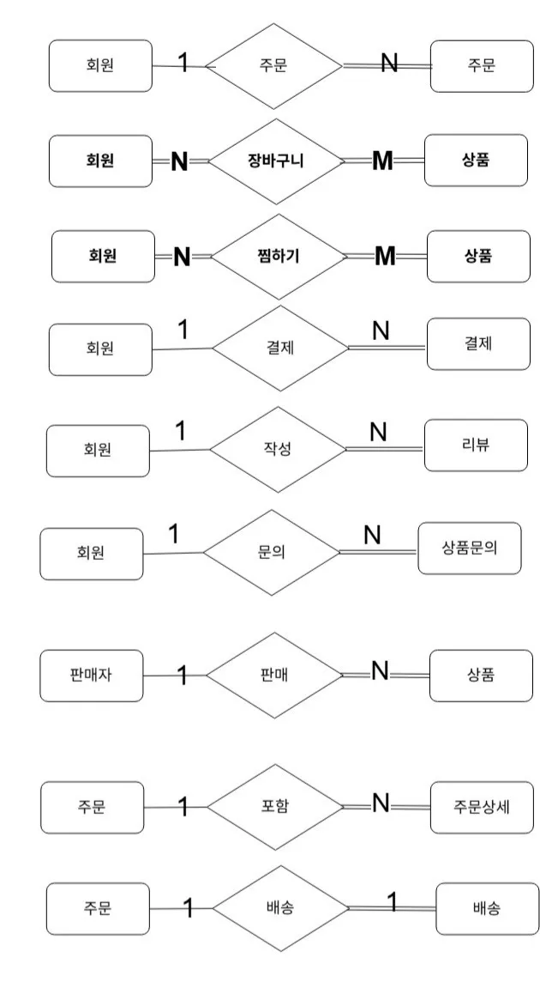

# 😍 2조 오라클 DB프로젝트

- 주제 - 쿠팡
- 팀명 - 부재중!
- 조원 - 신창만(조장), 양인석, 오수빈, 이시연, 이지훈
- 기간 - 2026.06.25 ~ ING

## 주제 선정

| 이름\찾아본 정보 | 주제 | 사이트주소 |
| --- | --- | --- |
| 신창만 | 숙박 예약(여기어때) | https://www.yeogi.com/ |
| 양인석 | 서울도서관 | https://lib.seoul.go.kr/ |
| 오수빈 | 쿠팡 | https://www.coupang.com/ |
| 이시연 | 게임 커뮤니티 | https://poe.inven.co.kr/ |
| 이지훈 | 우버 | https://www.uber.com/kr/ko/ |

## 😀 요구분석

### 1-1. 시스템 개요

온라인 쇼핑몰은 **일반회원**, **판매자**, **관리자** 세 가지 역할로 구성된다.

**일반회원**은 상품을 검색·구매·리뷰하는 소비자이고,
**판매자**는 상품을 등록·관리하고 주문을 처리하는 입점 업체이며,
**관리자**는 쇼핑몰 운영사(쿠팡) 내부 직원으로 전체 시스템을 관리·감독한다.

### 1-2. 기능 요구사항

#### [일반회원 기능]

> 쇼핑몰에서 상품을 탐색하고 구매하는 소비자 계정

**(1) 회원 가입 / 인증**
- 이메일, 비밀번호, 이름, 연락처를 입력하여 회원가입할 수 있다.
- 이메일 중복 확인을 한다.
- 로그인 / 로그아웃할 수 있다.
- 비밀번호를 변경할 수 있다.
- 회원 정보(이름, 연락처)를 수정할 수 있다.
- 회원 탈퇴를 할 수 있다. (탈퇴 시 상태를 비활성으로 변경)

**(2) 배송지 관리**
- 배송지 주소를 여러 개 등록할 수 있다.
- 배송지를 수정 / 삭제할 수 있다.
- 기본 배송지를 설정할 수 있다. (하나만 기본으로 지정)

**(3) 상품 탐색**
- 카테고리별로 상품 목록을 조회할 수 있다.
- 키워드로 상품을 검색할 수 있다.
- 상품 상세 페이지(가격, 재고, 옵션, 이미지, 리뷰 등)를 조회할 수 있다.
- 상품을 가격 / 평점 / 최신순으로 정렬할 수 있다.

**(4) 장바구니**
- 상품(옵션 포함)을 장바구니에 추가할 수 있다.
- 장바구니 내 상품 수량을 변경할 수 있다.
- 장바구니에서 상품을 삭제할 수 있다.
- 장바구니 항목을 선택하여 주문할 수 있다.

**(5) 찜 목록 (위시리스트)**
- 상품을 찜 목록에 추가 / 삭제할 수 있다.
- 찜 목록을 조회할 수 있다.
- 같은 상품을 중복으로 찜할 수 없다.

**(6) 주문 / 결제**
- 장바구니에서 선택하거나 상품 상세에서 바로구매로 주문할 수 있다.
- 주문 시 배송지, 결제 수단을 선택한다.
- 결제 수단: 신용카드
- 결제 상태: 결제대기 → 결제완료 → 취소 / 환불
- 주문 상태: 주문접수 → 상품준비 → 배송중 → 배송완료 → 구매확정 → 취소/반품/교환
- 주문 시 배송 요청사항(메모)을 입력할 수 있다.

**(7) 주문 관리**
- 자신의 주문 내역을 조회할 수 있다.
- 주문 상세(주문 상품, 결제금액, 배송지)를 확인할 수 있다.
- 배송 중 이전 단계의 주문을 취소할 수 있다.
- 배송 완료 후 반품 / 교환을 요청할 수 있다.
- 구매확정을 할 수 있다. (배송완료 후 일정 기간 내 미확정 시 자동 확정)

**(8) 배송 조회**
- 주문별 배송 현황(택배사, 송장번호, 예상 도착일)을 조회할 수 있다.
- 배송 상태 변화(발송/도착 등)를 확인할 수 있다.

**(9) 리뷰**
- 구매확정된 주문 상품에 한해 리뷰를 작성할 수 있다.
- 리뷰는 별점(1~5), 텍스트 내용, 이미지를 포함할 수 있다.
- 자신이 작성한 리뷰를 수정 / 삭제할 수 있다.

**(10) 상품문의**
- 상품에 한해 문의를 작성할 수 있다.
- 자신이 작성한 문의를 수정 / 삭제할 수 있다.
- 판매자가 답변을 달 수 있다.

#### [판매자 기능]

> 쇼핑몰에 입점하여 상품을 판매하는 사업자 계정
> 판매자 계정은 일반회원 계정과 별도로 존재하며, 사업자 정보를 등록하여 판매자로 전환된다.

**(1) 판매자 가입 / 인증**
- 사업자 번호, 브랜드명(업체명), 대표자명, 이메일, 연락처를 등록하여 입점 신청을 할 수 있다.
- 관리자 승인 후 판매자 계정이 활성화된다.
- 판매자 정보(브랜드명, 연락처 등)를 수정할 수 있다.

**(2) 상품 등록 / 관리**
- 상품명, 카테고리, 판매가격, 재고, 상품 설명, 배송 유형(일반)을 등록할 수 있다.
- 상품 대표 이미지 및 상세 이미지를 등록할 수 있다.(이미지등록 보류)
- 상품에 옵션(색상, 사이즈 등)을 추가할 수 있으며, 옵션별 추가 금액과 재고를 설정할 수 있다.
- 등록한 상품을 수정할 수 있다.
- 상품 판매를 중단(비활성화) / 재개할 수 있다.
- 상품을 삭제할 수 있다. (주문 이력이 있는 경우 비활성 처리)

**(3) 재고 관리(등록된 상품Update)**
- 상품 및 옵션별 재고 수량을 조회할 수 있다.
- 재고 수량을 수정할 수 있다.
- 재고가 일정 수량 이하일 때 확인할 수 있다.

**(4) 주문 관리**
- 자신의 상품에 대한 주문 내역을 조회할 수 있다.
- 주문 상태별(접수/준비/배송중 등)로 필터링하여 조회할 수 있다.
- 주문 상품을 준비하고 배송을 시작할 수 있다.
- 송장번호와 택배사를 입력하여 배송 처리를 할 수 있다.
- 배송 상태를 업데이트할 수 있다. (발송완료 → 배송중 → 배송완료)

**(5) 반품 / 교환 처리**
- 회원이 요청한 반품 / 교환 내역을 조회할 수 있다.
- 반품 / 교환을 승인 또는 거절할 수 있다.
- 처리 완료 후 재고를 복구할 수 있다.
- 반품테이블 필요 ⇒ 주문번호, 반품사유, 반품상태(대기,승인,처리), 반품유형(반품,교환)

**(6) 리뷰 관리**
- 자신의 상품에 달린 리뷰를 조회할 수 있다.

**(7) 상품문의 관리**
- 자신의 상품에 달린 상품문의를 조회할 수 있다.
- 상품문의에 판매자 답변(댓글)을 작성할 수 있다.
- 판매자 답변을 수정할 수 있다.

**(7) 판매 통계 (후순위)**

*매출 현황*
- 기간별(일/주/월/분기/연) 총 매출 금액을 조회할 수 있다.
- 기간별 총 주문 건수와 총 판매 수량을 조회할 수 있다.
- 기간 내 취소·반품으로 인한 환불 금액을 조회할 수 있다.
- 실매출(총매출 - 환불금액)을 조회할 수 있다.
- 오늘 / 이번 주 / 이번 달 매출을 대시보드에서 한눈에 확인할 수 있다.

*상품별 통계*
- 상품별 판매 수량과 매출 금액을 조회할 수 있다.
- 판매 수량 기준 상위 N개 상품(베스트셀러)을 조회할 수 있다.
- 매출 금액 기준 상위 N개 상품을 조회할 수 있다.
- 상품별 취소율 / 반품율을 조회할 수 있다.
- 재고 소진율(판매 수량 / 초기 재고)을 상품별로 확인할 수 있다.

*주문 상태별 통계*
- 현재 주문 상태별(접수/준비중/배송중/완료/취소/반품) 건수를 조회할 수 있다.
- 기간별 취소 건수와 취소율을 조회할 수 있다.
- 기간별 반품 건수와 반품율을 조회할 수 있다.
- 평균 주문 처리 시간(주문접수 → 발송 완료)을 조회할 수 있다.

*리뷰 / 평점 통계*
- 전체 상품의 평균 별점을 조회할 수 있다.
- 상품별 평균 별점과 리뷰 수를 조회할 수 있다.
- 별점 구간(1~5점)별 리뷰 건수 분포를 조회할 수 있다.
- 최근 작성된 리뷰 목록을 최신순으로 조회할 수 있다.
- 미답변 리뷰 목록을 조회할 수 있다.

#### [관리자 기능]

> 쇼핑몰 운영사(쿠팡) 내부 직원 계정
> 전체 시스템을 관리·감독하며, 회원/판매자/상품/주문 등 모든 데이터에 접근 권한을 가진다.

**(1) 관리자 계정 관리**
- 관리자 계정으로 로그인 / 로그아웃할 수 있다.
- 관리자 계정은 별도의 가입 절차 없이 시스템 내부에서 생성된다.
- 관리자 권한은 1개만 존재

**(2) 회원 관리**
- 전체 회원 목록을 조회할 수 있다.
- 회원을 이름, 이메일, 가입일 등으로 검색할 수 있다.
- 회원 상세 정보(주문 내역, 리뷰 등)를 조회할 수 있다.
- 회원 계정을 활성화 / 비활성화(정지)할 수 있다.
- 탈퇴 회원 내역을 조회할 수 있다.

**(3) 판매자 관리**
- 판매자 입점 신청 목록을 조회할 수 있다.
- 판매자 입점을 승인 / 거절할 수 있다.
- 전체 판매자 목록을 조회할 수 있다.
- 판매자 상세 정보(등록 상품, 매출, 주문 내역)를 조회할 수 있다.
- 판매자 계정을 활성화 / 비활성화(정지)할 수 있다.
- 규정 위반 판매자에게 다음과 같은 제재를 가할 수 있다.
  - **경고 처리** : 위반 사항을 판매자에게 통보하고 경고 횟수를 누적한다.
  - **상품 강제 비활성화** : 허위 정보·불법 상품 등 규정 위반 상품의 판매를 강제로 중단시킨다.
  - **판매 일시 정지** : 일정 기간 동안 신규 상품 등록 및 주문 접수를 금지한다.
  - **판매자 계정 비활성화(정지)** : 계정 로그인을 차단하여 모든 판매 활동을 중단시킨다.
  - **강제 퇴점(영구 정지)** : 중대한 위반(사기·위조품 판매 등) 시 계정을 영구적으로 비활성화하고 재입점을 불가하게 한다.

**(4) 카테고리 관리**
- 카테고리(대/중/소분류)를 등록할 수 있다.
- 카테고리명과 정렬 순서를 수정할 수 있다.
- 카테고리를 삭제할 수 있다. (연결된 상품이 있으면 삭제 불가)
- 카테고리 계층 구조를 조회할 수 있다.

**(5) 상품 관리**
- 전체 상품 목록을 조회할 수 있다.
- 상품을 카테고리, 판매자, 배송 유형 등으로 필터링하여 조회할 수 있다.
- 부적절한 상품을 강제로 비활성화(판매 중단)할 수 있다.
- 상품의 배송 유형을 일반배송 / 로켓배송 / 로켓프레시로 설정 / 변경할 수 있다.
- 상품 할인율을 직접 적용할 수 있다.

**(6) 주문 / 결제 관리**
- 전체 주문 목록을 조회할 수 있다.
- 주문을 회원, 날짜, 상태별로 검색할 수 있다.
- 특정 주문의 상세 내역(상품, 결제, 배송 정보)을 조회할 수 있다.
- 회원-판매자 간 분쟁이 발생한 주문에 개입하여 처리할 수 있다.
- 환불을 강제로 처리할 수 있다.
- 결제 취소를 강제로 처리할 수 있다.

**(7) 배송 관리**
- 전체 배송 현황을 조회할 수 있다.
- 배송 지연 건을 필터링하여 조회할 수 있다.
- 로켓배송 / 일반배송 / 새벽배송 유형별로 현황을 조회할 수 있다.

**(8) 쿠폰 관리 (우선순위 낮음)**
- 쿠폰을 생성할 수 있다. (적용 범위: 전체 / 카테고리 / 특정 상품)
- 할인 방식을 정액(원) 또는 정률(%)로 설정할 수 있다.
- 쿠폰 사용 기간, 최소 주문 금액, 최대 할인 금액을 설정할 수 있다.
- 특정 회원 또는 전체 회원에게 쿠폰을 일괄 발급할 수 있다.
- 쿠폰 사용 현황을 조회할 수 있다.
- 쿠폰을 비활성화(사용 중단)할 수 있다.

**(9) 리뷰 관리**
- 전체 리뷰를 조회할 수 있다.
- 욕설, 허위 정보 등 부적절한 리뷰를 삭제할 수 있다.
- 리뷰 신고 내역을 조회하고 처리할 수 있다.

**(10) 통계 / 리포트**

*매출 통계*
- 기간별(일/주/월/분기/연) 전체 매출 금액과 주문 건수를 조회할 수 있다.
- 전일 / 전주 / 전월 대비 매출 증감율을 조회할 수 있다.
- 결제 수단별(카드/계좌이체/쿠페이/무통장) 결제 금액 비중을 조회할 수 있다.
- 배송 유형별(로켓/일반/새벽) 주문 금액 비중을 조회할 수 있다.
- 기간별 환불 금액과 환불율을 조회할 수 있다.
- 실매출(총매출 - 환불금액) 추이를 기간별로 조회할 수 있다.

*회원 통계*
- 신규 회원 가입 수를 일/주/월별로 조회할 수 있다.
- 전체 회원 수 및 활성 / 비활성(정지·탈퇴) 회원 수를 조회할 수 있다.
- 일반 회원과 로켓와우 회원의 비율을 조회할 수 있다.
- 회원 등급별 평균 구매 금액(객단가)을 조회할 수 있다.
- 재구매율(2회 이상 주문한 회원 비율)을 조회할 수 있다.

*상품 / 카테고리 통계*
- 카테고리별 총 매출 금액과 주문 건수를 조회할 수 있다.
- 카테고리별 매출 순위를 조회할 수 있다.
- 판매량 기준 인기 상품 Top N을 조회할 수 있다.
- 매출 금액 기준 인기 상품 Top N을 조회할 수 있다.
- 재고 부족(품절 임박) 상품 목록을 조회할 수 있다.
- 판매가 중단된(비활성) 상품 수를 조회할 수 있다.

*판매자 통계*
- 판매자별 총 매출 금액과 주문 건수를 조회할 수 있다.
- 매출 기준 판매자 순위를 조회할 수 있다.
- 판매자별 반품율 / 취소율을 조회할 수 있다.
- 신규 입점 판매자 수를 기간별로 조회할 수 있다.
- 판매자별 평균 리뷰 평점을 조회할 수 있다.

*주문 / 배송 통계*
- 주문 상태별(접수/준비/배송중/완료/취소/반품/교환) 건수를 조회할 수 있다.
- 기간별 취소 건수와 취소율을 조회할 수 있다.
- 기간별 반품 건수와 반품율을 조회할 수 있다.
- 배송 유형별 평균 배송 소요일을 조회할 수 있다.
- 배송 지연 발생 건수와 지연율을 조회할 수 있다.

*쿠폰 통계 (우선순위 낮음)*
- 쿠폰별 발급 수와 사용 수, 사용율을 조회할 수 있다.
- 쿠폰으로 할인된 총 금액을 기간별로 조회할 수 있다.
- 만료 예정 쿠폰 목록을 조회할 수 있다.

*리뷰 통계*
- 기간별 신규 리뷰 작성 건수를 조회할 수 있다.
- 전체 상품의 평균 별점을 조회할 수 있다.
- 별점 구간(1~5점)별 리뷰 건수 분포를 조회할 수 있다.
- 삭제 처리된 리뷰 건수(신고 처리 포함)를 조회할 수 있다.

## 기능 분류 요약

**회원관리 (Member)**
- 회원가입
- 로그인/로그아웃
- 회원정보 수정
- 회원탈퇴
- 배송지 관리
- 비밀번호 찾기

**상품관리**
- 카테고리별 조회
- 상품 검색

**주문관리**
- 상품 주문
- 주문 취소
- 주문 내역 조회
- 주문 상태 확인
- 장바구니

**장바구니**
- 장바구니 담기
- 장바구니 삭제
- 수량 변경
- 주문하기

**결제관리**
- 카드 결제
- 계좌이체
- 간편결제
- 결제 내역 조회

**배송관리**
- 배송 조회
- 배송 상태 변경
- 송장번호 관리
- 배송지 관리

**리뷰관리**
- 리뷰 작성
- 리뷰 수정
- 리뷰 삭제
- 평점 등록

**업체(Seller)**
- 상품판매 현황
- 상품 등록
- 상품 수정
- 상품 삭제
- 상품 조회

**알림시스템**
- 알림메세지

## 개체 / 속성추출

| 유저 |  |
| --- | --- |
| 회원 | 회원번호, 아이디, 비밀번호, 이름, 전화번호, 이메일, 배송지Object, 결제Object, 등급, 장바구니, 찜하기 |
| 배송지 | 회원번호, 배송지주소, 기본유무 |
| 장바구니 | 회원번호, 상품번호, 상품옵션번호, 갯수 |
| 찜목록 | 회원번호, 상품번호, 상품옵션번호 |
| 주문 | 회원번호, 주문번호, 상품번호, 상품옵션번호, 총구매가격(최종결제금액), 구매일, 배송비, 상품번호, 상품옵션번호, 갯수, 가격 (N개) |
| 배송 | 회원번호, 주문번호, 배송지주소, 배송상태, 시작일, 완료일 |
| 판매자 |  |
| 판매자 | no, 아이디, 비밀번호, 전화번호, 상호, 대표자, 사업자등록번호, 사업장주소, 이메일 |
| 상품 | no, 분류코드, 상품코드, 상품명, 상품설명, 상품금액, 갯수, 옵션Object(수량, 색, 가격) |
|  | 상품번호, 색, 사이즈, 수량(재고), 가격 |
| 관리자 |  |
| 상품카테고리 | no, 대분류, 중분류, 소분류 |
| 관리자 | no, 아이디, 비밀번호, 등급 |
| 카테고리 | 대분류, 중분류, 소분류 |

## 관계 추출

| 관계명 | 참여 개체 | 카디널리티 | 속성 |
| --- | --- | --- | --- |
| 구매 | 회원 (필수), 상품 (필수) | 1:n | no, 유저번호, 상품번호, 구매일, 결제방법 |
| 유저 |  |  |  |
| 배송 | 회원 (필수), 상품 (필수) | 1:1 | no, 구매번호, 배송현황, 택배사, 송장번호, 상태(반품) |
| 리뷰 | 상품 (필수), 회원 (필수), 판매자 (필수) | 1:n | 상품no, 설명, 별(1~5) |
| 판매자 |  |  |  |
| 판매 | 회원, 상품 | 1:N |  |
| 관리자 |  |  |  |

## 😀 E-R 다이어그램

쿠팡 - [draw.io](https://app.diagrams.net/#G1REe8XGdkwUZLi0IWm7a5iwyKggPak6c4#%7B%22pageId%22%3A%22-Pq9iF7i17TWvhQfLu-N%22%7D)






**12페이지 관계 다이어그램 요약 (텍스트화):**

- 회원 `1 --- N` 주문
- 회원 `N === M` 장바구니 `=== M` 상품
- 회원 `N === M` 찜하기 `=== M` 상품
- 회원 `1 --- N` 결제
- 회원 `1 --- N` 작성(리뷰)
- 회원 `1 --- N` 문의(상품문의)
- 판매자 `1 --- N` 판매(상품)
- 주문 `1 --- N` 포함(주문상세)
- 주문 `1 --- 1` 배송

## 😀 초기 파트

| 이름 | 맡은영역 |
| --- | --- |
| 신창만 | 상품옵션 처리 |
| 양인석 | 쿠팡 시스템 분석하여 누락된 항목 추가 |
| 오수빈 | ERD수정 |
| 이시연 | 다이어그램 |
| 이지훈 | ERD수정 |

## 😀 자료

- 쿠팡 주문배송지추가.exerd
- 2026-07-072 17:31:00 장바구니 수량추가, 회원 상태값추가, 판매자 상태값추가
- 2026-07-03 16:12:00 결제-회원 회원번호 삭제

## 😀 엑셀 자료

https://docs.google.com/spreadsheets/d/1_L0FkvTZCe6JBDMqDr1304Ke5S07kYegds9SWbxILU/edit?usp=sharing

## 😀 각자 파트 코드 (정보는 2~3개씩만 추가)

| 테이블 인서트 분담 (컬러) | 테이블 명 |
| --- | --- |
| 신창만 - 커피색 | 상품 등록, 입고, 상품목록보기(판매자기준), 카테고리별로 상품보기, 회원가입, 판매자가입, 관리자승인, 상품문의, 문의답변, 문의내역보기 |
| 양인석 - 밤하늘색 | 배송, 주문 |
| 오수빈 - 페루오팔 색 | 관리자, 상품 분류 (대, 중, 소), 상품, 장바구니, 찜목록, 유저 결제내역 조회 |
| 이시연 - 자수정 색 | 판매자, 리뷰 |
| 이지훈 - 들풀 색 | 회원, 배송지, 반품 |

```sql
-----------------------------------------------------------------
-------------------------
-- 단순 조회구문 --------------------------------------------------
------------------------
--***************************************************************
*************************
SELECT * FROM ADMIN; -- 관리자 조회
SELECT * FROM CART; -- 장바구니 조회
SELECT * FROM MAIN_CATEGORY; -- 카테고리(대) 조회
SELECT * FROM MID_CATEGORY; -- 카테고리(중) 조회
SELECT * FROM SUB_CATEGORY; -- 카테고리(소) 조회
SELECT * FROM MEMBER; -- 회원 조회
SELECT * FROM ORDERS; -- 주문 조회
SELECT * FROM ORDER_DETAIL; -- 주문상세 조회
SELECT * FROM ORDER_ADDRESS; -- 주문배송지 조회
SELECT * FROM PAYMENT; -- 결제(회원) 조회
SELECT * FROM PRODUCT; -- 상품 조회
SELECT * FROM PRODUCT_IN -- 입고 조회
SELECT * FROM PRODUCT_INQUIRY -- 상품문의 조회
SELECT * FROM PRODUCT_INQUIRY_ANSWER -- 상품문의답변 조회
SELECT * FROM PRODUCT_OPTION -- 상품재고상태 조회
SELECT * FROM PRODUCT_RETURN -- 반품 조회
SELECT * FROM REVIEW -- 리뷰 조회
SELECT * FROM SELLER -- 판매자 조회
SELECT * FROM STOCK_HISTORY -- STOCK_HISTORY 조회
SELECT * FROM WISHLIST -- 찜하기 조회
SELECT * FROM DELIVERY; -- 배송 조회
SELECT * FROM DELIVERY_ADDRESS; -- 배송주소 조회
-----------------------------------------------------------------
-------------------------
```

## 📁 코드모음

- 테이블 생성 및 상품등록 - 신창만
- 주문 - 양인석
- 관리자, 상품 분류, 찜 목록, 장바구니, 유저별 결제 내역 - 오수빈
- 판매자 / 리뷰 - 이시연
- 회원, 배송지, 반품 - 이지훈

## 😀 최종 쿼리 취합

## 😊 기본 Data Insert

**샘플데이터 입력(프로시저)**
- [ ] 회원가입
- [ ] 판매자 가입
- [ ] 상품등록 (메인상품, 서브상품1개)
- [ ] 상품구매

## 추가 논의 사항

- DB는 공용DB가 필요함. ⇒ 완료
- 시퀀스 추가필요 ⇒ 완료
- 트리거
- 판매자가 입고/재고에 대해서 따로 테이블을 추가해야할까?
- 로그는 어떻게 하는게 좋을까? ⇒ 보류
- 테이블
  - 장바구니에 수량추가,
  - 주문/배송지 테이블 수정됨


